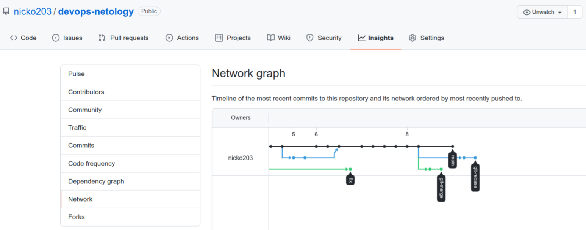
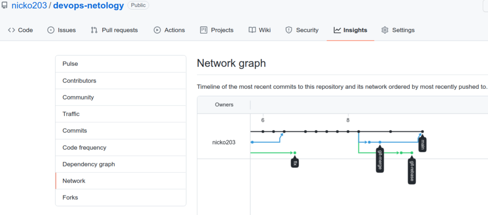
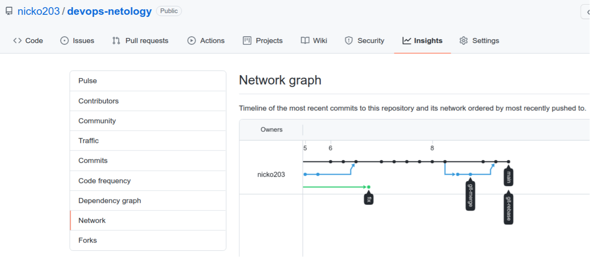

# Домашнее задание к занятию «2.3. Ветвления в Git»

## Задание №1 – Ветвление, merge и rebase.

- Состояние после создания веток git-merge и git-rebase:

- Состояние после слияния веток main и git-merge:

- Состояние после выполнения rebase:

