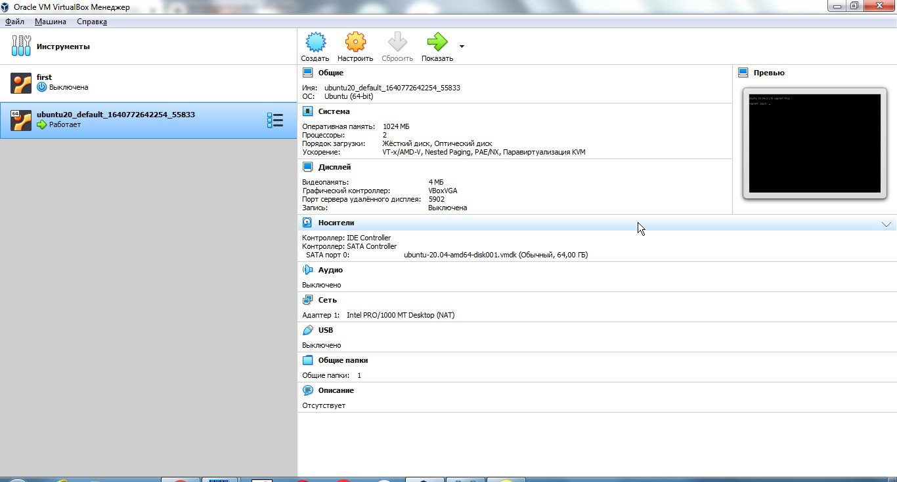
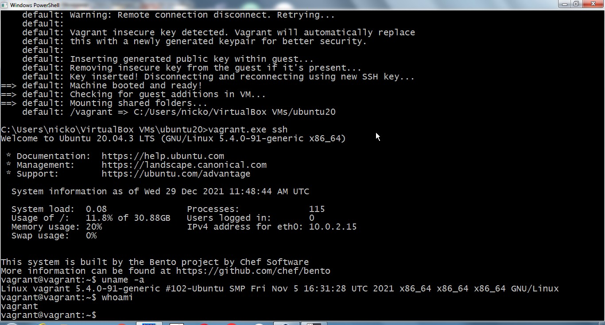
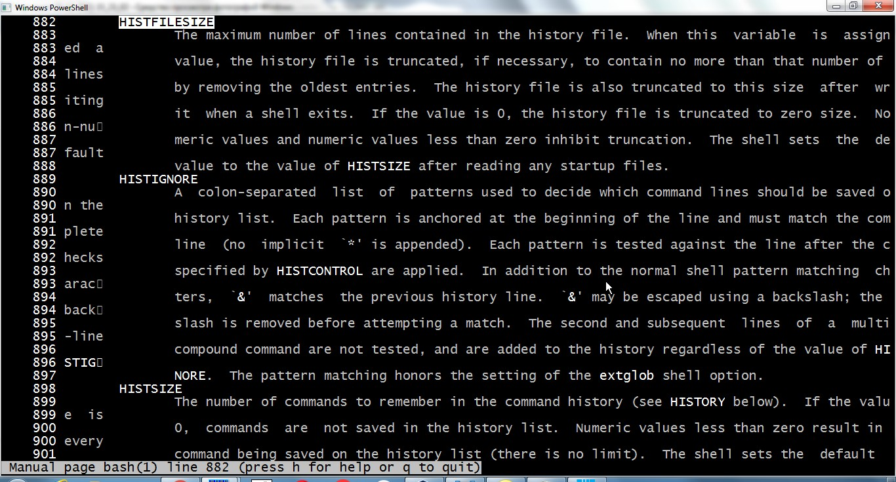
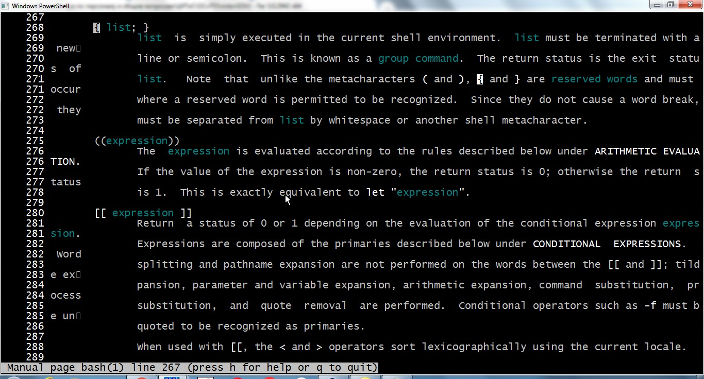

## Домашнее задание к занятию "3.1. Работа в терминале, лекция 1"

### 1. Установка Oracle VirtualBox:

**Oracle VirtualBox** установлен на рабочей станции под управлением Windows 7 x64.

### 2. Установка Hashicorp Vagrant:

**Hashicorp** Vagrant установлен на рабочей станции под управлением Windows 7 x64.

### 3. -

### 4. С помощью базового файла конфигурации запустите Ubuntu 20.04 в VirtualBox посредством Vagrant.

- создан каталог для хранения виртуальной машины;
- выполнена инициализация: *vagrant init* ;
- скорректирован файл конфигурации;
- виртуальная машина запушена: *vagrant up* :

### 5. Графический интерфейс VirtualBox

По умолчанию выделенно: 1 ГБ ОЗУ, 2 ядра CPU.

### 6. Добавление ресурсов

Для добавления ресурсов ВМ корректируем файл Vagrantfile, увеличиваем размер ОЗУ до 2 ГБ:

Vagrant.configure("2") do |config|

  config.vm.box = "bento/ubuntu-20.04"
  
  config.vm.provider "virtualbox" do |v|

    v.memory = 2048

    v.cpus = 2

  end

end

Для вступления изменений в силу перечитываем конфигурацию: *vagrant reload*

### 7. Доступ к консоли виртуальной машины: vagrant ssh

### 8. Знакомство с man bash

- Количество команд, сохраняемых в файле истории команд, может быть установлено с помощью переменной окружения $HISTFILESIZE, строка man bash 882
- Переменная $HISTSIZE устанавливает количество команд, которые будут сохраняться при работе в вашем текущем окружении, строка man bash 898

### 9. В каких сценариях использования применимы скобки {} и на какой строчке man bash это описано?
{list} список выполняется в текущей среде оболочки. список должен заканчиваться символом новой строки или точкой с запятой. Это известно как групповая команда.
Обратите внимание, что в отличие от метасимволов ( и ), { и } являются зарезервированными словами и должны встречаться там, где разрешено распознавать зарезервированное слово.
Поскольку они не вызывают разрыва слов, они должны быть отделены от списка пробелом или другим метасимволом оболочки.

Cтрока man bash 268

Пример создания каталогов: *mkdir /usr/local/src/bash/{old,new,dist,bugs}*

### 10. С учётом ответа на предыдущий вопрос, как создать однократным вызовом touch 100000 файлов? Получится ли аналогичным образом создать 300000? Если нет, то почему?

