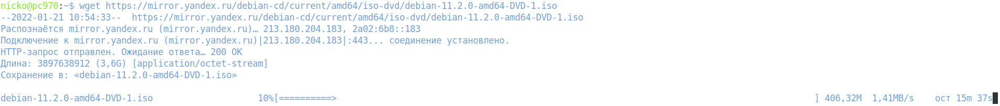
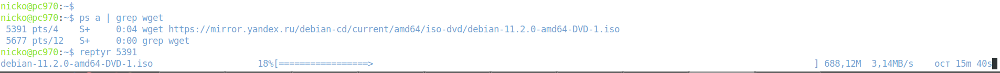

## Домашнее задание к занятию "3.2. Работа в терминале, лекция 2"

### 1. Какого типа команда cd? Попробуйте объяснить, почему она именно такого типа; опишите ход своих мыслей, если считаете что она могла бы быть другого типа.

**_$ type cd_**  
cd is a shell builtin  
cd — это встроенная команда bash  

Встроенная команда - это команда, которую оболочка выполняет сама, вместо того, чтобы интерпретировать ее как запрос на загрузку и запуск какой-либо другой программы( со своим pid ) .
Это имеет два основных эффекта. Во-первых, обычно это быстрее, потому что загрузка и запуск программы требуют времени.
Во-вторых, встроенная команда может влиять на внутреннее состояние оболочки. Вот почему такие команды cd должны быть встроенными, потому что внешняя программа не может изменить текущий каталог оболочки.

### 2. Какая альтернатива без pipe команде grep <some_string> <some_file> | wc -l? man grep поможет в ответе на этот вопрос. Ознакомьтесь с документом о других подобных некорректных вариантах использования pipe.

Команда **_grep <some_string> <some_file> | wc -l_** выполняет следующие действия:
- grep <some_string> <some_file>   - производит поиск подстроки <some_string> в файле <some_file> и выводит в консоль полные строки, содержащие подстроку;
- wc -l - подсчитывает количество выведенных строк, возвращает число.

Альтернативная команда: **_grep -с <some_string> <some_file>_**

### 3. Какой процесс с PID 1 является родителем для всех процессов в вашей виртуальной машине Ubuntu 20.04?

**_$ pstree -p_**

systemd(1)-+-VBoxService(829)-  
           |  
           |-accounts-daemon(624)-  
           |  

### 4. Как будет выглядеть команда, которая перенаправит вывод stderr ls на другую сессию терминала?

**_$ ls -l \abracadabra 2>/dev/pts/2_**

Вывод в терминале pts/2:  
*_ls: невозможно получить доступ к 'abracadabra': Нет такого файла или каталога_*

### 5. Получится ли одновременно передать команде файл на stdin и вывести ее stdout в другой файл? Приведите работающий пример.

Содержимое файла test.txt:

**_$ cat ./test.txt_**  
aaaAaaa  
dddDddd  
hhhHhhh

Передаём  test.txt на вход команды grep , результат выводим в out.log

**_$ grep "aAa" <./test.txt > ./out.log_**  
**_$ cat ./out.log_**  
aaaAaaa

### 6. Получится ли находясь в графическом режиме, вывести данные из PTY в какой-либо из эмуляторов TTY? Сможете ли вы наблюдать выводимые данные?

### 7. Выполните команду bash 5>&1. К чему она приведет? Что будет, если вы выполните echo netology > /proc/$$/fd/5? Почему так происходит?

Команда **_bash 5>&1_** создаёт дескриптор с номером 5 и перенаправляет вывод с него в stdout.

**_$ ls -l /proc/$$/fd/_**  
итого 0  
lrwx------ 1 nicko nicko 64 янв 20 10:50 0 -> /dev/pts/4  
lrwx------ 1 nicko nicko 64 янв 20 10:50 1 -> /dev/pts/4  
lrwx------ 1 nicko nicko 64 янв 20 10:50 2 -> /dev/pts/4  
lrwx------ 1 nicko nicko 64 янв 20 10:50 255 -> /dev/pts/4  
lrwx------ 1 nicko nicko 64 янв 20 10:46 5 -> /dev/pts/4  

Команда **_echo netology > /proc/$$/fd/5_** - выведет *_netology_* в дескриптор "5", который был перенаправлен в stdout  

**_$ echo netology > /proc/$$/fd/5_**  
netology  

### 8. Получится ли в качестве входного потока для pipe использовать только stderr команды, не потеряв при этом отображение stdout на pty? Напоминаем: по умолчанию через pipe передается только stdout команды слева от | на stdin команды справа. Это можно сделать, поменяв стандартные потоки местами через промежуточный новый дескриптор, который вы научились создавать в предыдущем вопросе.

Выполним листинг двух каталогов: существующего и несуществующего:  

**_$ (ls -l /home/nicko/tmp1/tmp ; ls -l /home/nicko/tmp2/tmp)  5>&2 2>&1 1>&5 | grep -c tmp2_**  
итого 8  
-rw-r--r-- 1 nicko nicko  8 янв 18 14:34 out.log  
-rw-r--r-- 1 nicko nicko 24 янв 18 14:33 test.txt  
1  

### 9. Что выведет команда cat /proc/$$/environ? Как еще можно получить аналогичный по содержанию вывод?

Будут выведены переменные окружения:
Аналогичный результат можно получить с помощью команд **_printenv_** и **_env_**

### 10. Используя man, опишите что доступно по адресам /proc/\<PID\>/cmdline, /proc/\<PID\>/exe

**_/proc/\<PID\>/cmdline_**
Этот файл, доступный только для чтения, содержит полную командную строку для процесса, если только процесс не является зомби.  В последнем случае в этом файле ничего нет: то есть только для чтения
этот файл вернет 0 символов.  Аргументы командной строки отображаются в этом файле в виде набора строк, разделенных нулевыми байтами ('\0'), с дополнительным нулевым байтом после
последней строки.  
строка в man: 142  

**_/proc/\<PID\>/exe_**
В Linux 2.2 и более поздних версиях этот файл представляет собой символическую ссылку, содержащую фактический путь к выполняемой команде. Эта символическая ссылка может быть разыменована в обычном режиме; попытка‐
попытка открыть его приведет к открытию исполняемого файла. Вы даже можете ввести /proc/[pid]/exe, чтобы запустить другую копию того же исполняемого файла, который запускается процессом [pid].  
строка в man: 185  

### 11. Узнайте, какую наиболее старшую версию набора инструкций SSE поддерживает ваш процессор с помощью /proc/cpuinfo.

**_$ cat /proc/cpuinfo | grep  -i SSE_**  
Старшая версия SSE: sse4_2  

### 12. При открытии нового окна терминала и vagrant ssh создается новая сессия и выделяется pty. Это можно подтвердить командой tty, которая упоминалась в лекции 3.2. 
### Однако:  
**_vagrant@netology1:~$ ssh localhost 'tty'_**  
*_not a tty_*  
### Почитайте, почему так происходит, и как изменить поведение.  

По умолчанию, когда запускается команда на удаленном компьютере с помощью ssh, TTY не выделяется для удаленного сеанса.  
Для принудительного запуска оболочки следует использовать флаг **_-t_** :  

**_$ ssh -t localhost 'tty'_**  
*_nicko@localhost's password:_*  
*_/dev/pts/11_*  
*_Connection to localhost closed._*  

### 13. Бывает, что есть необходимость переместить запущенный процесс из одной сессии в другую. Попробуйте сделать это, воспользовавшись reptyr. Например, так можно перенести в screen процесс, который вы запустили по ошибке в обычной SSH-сессии.  

В терминале pts/4 запускаю загрузку образа Debian: **_$ wget https://mirror.yandex.ru/debian-cd/current/amd64/iso-dvd/debian-11.2.0-amd64-DVD-1.iso_**  
  

Открываю новый терминал, выясняю PID, запущенного процесса wget и переношу его в текущую сессию:  

### 14. sudo echo string > /root/new_file не даст выполнить перенаправление под обычным пользователем, так как перенаправлением занимается процесс shell'а, который запущен без sudo под вашим пользователем. Для решения данной проблемы можно использовать конструкцию echo string | sudo tee /root/new_file. Узнайте что делает команда tee и почему в отличие от sudo echo команда с sudo tee будет работать.

Команда **_tee_** читает из стандартного ввода и записывает как в стандартный вывод, так и в один или несколько файлов одновременно. **_tee_** в основном используется в сочетании с другими командами через pipe  
В основном команда **_tee_** используется для отображения стандартного вывода ( stdout ) программы и записи его в файл.

При выполнении команды **_echo string | sudo tee /root/new_file_**  
**_tee_** получит вывод команды **_echo_** , повысит разрешения до **_sudo_** и запишет в файл.  
Использование **_tee_** в сочетании с **_sudo_** позволяет записывать файлы, принадлежащие другим пользователям.  

