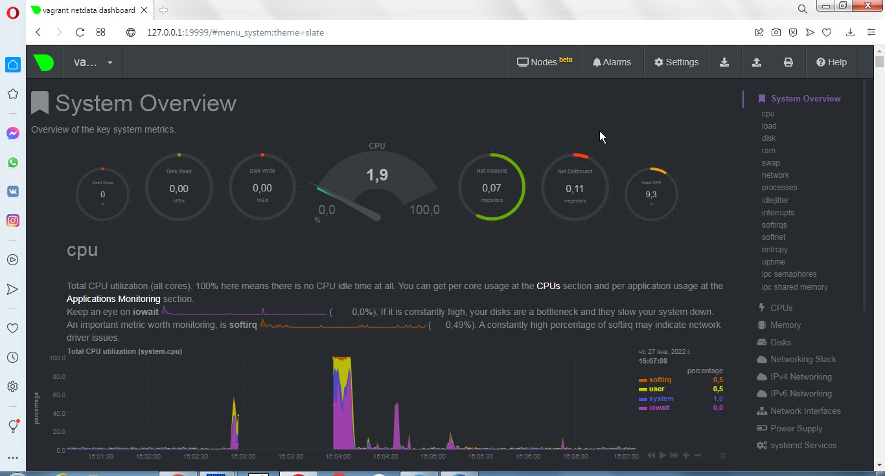
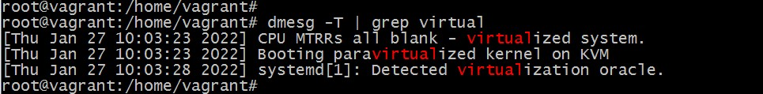

## Домашнее задание к занятию "3.4. Операционные системы, лекция 2"  

### 1. На лекции мы познакомились с node_exporter. В демонстрации его исполняемый файл запускался в background. Этого достаточно для демо, но не для настоящей production-системы, где процессы должны находиться под внешним управлением. Используя знания из лекции по systemd, создайте самостоятельно простой unit-файл для node_exporter:  

1.1. Создан init-файл *_/etc/systemd/system/node_exporter.service_*:  

*_[Unit]_*  
*_Description=Node Exporter Service_*  
*_After=network.target_*  

*_[Service]_*  
*_Type=simple_*  
*_EnvironmentFile=-/etc/default/node_exporter_*  
*_ExecStart=/usr/local/bin/node_exporter $NODE_EXPORTER_OPTS_*  
*_ExecReload=/bin/kill -HUP $MAINPID_*  
*_Restart=on-failure_*  

*_[Install]_*  
*_WantedBy=multi-user.target_*  

1.2. Создан файл *_/etc/default/node_exporter_*  для передачи опций процессу:  

*_cat /etc/default/node_exporter_*  
NODE_EXPORTER_OPTS=  

1.3. Процесс добавлен в автозагрузку:  

*_systemctl enable node_exporter.service_*

1.4. Через *_systemctl_* процесс успешно стартует, останавливается, рестартует, переменные из внешнего файла передаются:  

### 2. Ознакомьтесь с опциями node_exporter и выводом /metrics по-умолчанию. Приведите несколько опций, которые вы бы выбрали для базового мониторинга хоста по CPU, памяти, диску и сети.  

### 3. Установите в свою виртуальную машину Netdata. Воспользуйтесь готовыми пакетами для установки (sudo apt install -y netdata). После успешной установки:  

Пакет *_netdata_* установлен. Проброшен порт 19999 с VM на хост-машину.  
Подключение из браузера к 127.0.0.1:19999  

### 4. Можно ли по выводу dmesg понять, осознает ли ОС, что загружена не на настоящем оборудовании, а на системе виртуализации?  

Да, можно. Вывод соотвествующих строк на скриншоте - используется KVM-виртуализация. На "железном" оборудовании строка имеет вид: "Booting paravirtualized kernel on bare hardware"  
  
  

### 5. Как настроен sysctl fs.nr_open на системе по-умолчанию? Узнайте, что означает этот параметр. Какой другой существующий лимит не позволит достичь такого числа (ulimit --help)?  
  
*_$ sysctl fs.nr_open_*  
*_fs.nr_open = 1048576_*  

**_nr\_open_** - максимальное количество файлов, которое может быть выделено одним процессом.  

Кроме того, количество открытых файлов ограничивается:  
**_ulimit -Sn_** - "мягкий" лимит, максимальное количество файловых дескрипторов, которые могут быть открыты. Может быть увеличен.  
  
*_$ ulimit -Sn_*  
1024  

**_ulimit -Hn_** - "жёсткий" лимит, не может быть больше fs.nr_open. Значение "жёсткого" лимита можно только уменьшить.  

*_$ ulimit -Hn_*  
1048576  

### 6. Запустите любой долгоживущий процесс (не ls, который отработает мгновенно, а, например, sleep 1h) в отдельном неймспейсе процессов; покажите, что ваш процесс работает под PID 1 через nsenter. Для простоты работайте в данном задании под root (sudo -i). Под обычным пользователем требуются дополнительные опции (--map-root-user) и т.д.  

