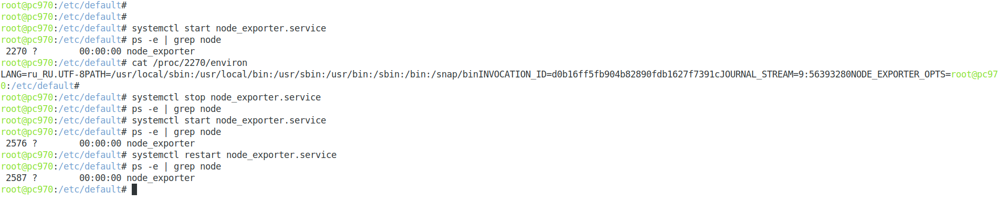

## Домашнее задание к занятию "3.4. Операционные системы, лекция 2"  

### 1. На лекции мы познакомились с node_exporter. В демонстрации его исполняемый файл запускался в background. Этого достаточно для демо, но не для настоящей production-системы, где процессы должны находиться под внешним управлением. Используя знания из лекции по systemd, создайте самостоятельно простой unit-файл для node_exporter:  

1.1. Создан init-файл *_/etc/systemd/system/node_exporter.service_*:  

*_[Unit]  
Description=Node Exporter Service  
After=network.target  

[Service]  
Type=simple  
EnvironmentFile=-/etc/default/node_exporter  
ExecStart=/usr/local/bin/node_exporter $NODE_EXPORTER_OPTS  
ExecReload=/bin/kill -HUP $MAINPID  
Restart=on-failure  

[Install]  
WantedBy=multi-user.target_*  

1.2. Создан файл *_/etc/default/node_exporter_*  для передачи опций процессу:  

*_cat /etc/default/node_exporter_*  
NODE_EXPORTER_OPTS=  

1.3. Процесс добавлен в автозагрузку:  

*_systemctl enable node_exporter.service_*

1.4. Через *_systemctl_* процесс успешно стартует, останавливается, рестартует, переменные из внешнего файла передаются:  

### 2. Ознакомьтесь с опциями node_exporter и выводом /metrics по-умолчанию. Приведите несколько опций, которые вы бы выбрали для базового мониторинга хоста по CPU, памяти, диску и сети.  

