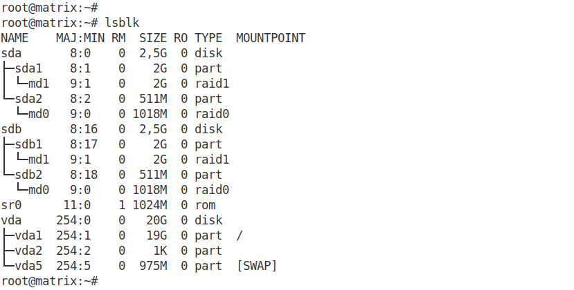
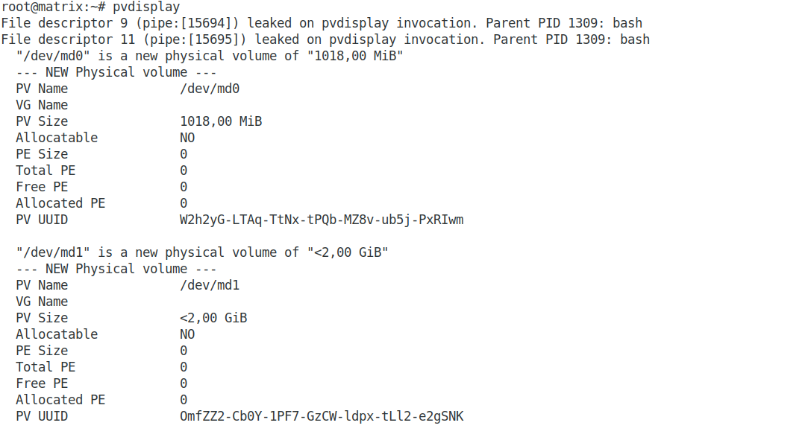
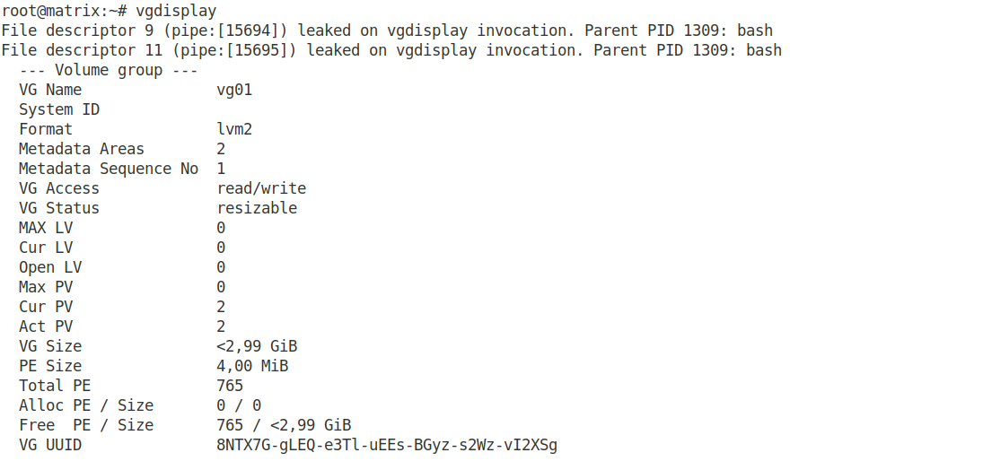
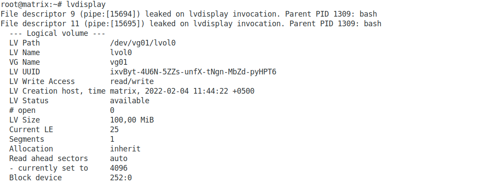
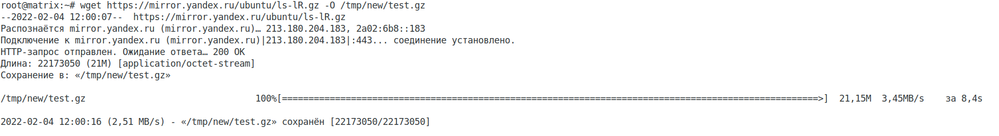
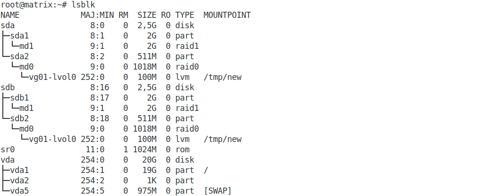

## Домашнее задание к занятию "3.5. Файловые системы  

### 1. Узнайте о sparse (разряженных) файлах.  

Разрежённый файл (англ. sparse file) — файл, в котором последовательности нулевых байтов[1] заменены на информацию об этих последовательностях (список дыр).  
Дыра (англ. hole) — последовательность нулевых байт внутри файла, не записанная на диск. Информация о дырах (смещение от начала файла в байтах и количество байт) хранится в метаданных ФС.  

Преимущества:  

- экономия дискового пространства. Использование разрежённых файлов считается одним из способов сжатия данных на уровне файловой системы;  
- отсутствие временных затрат на запись нулевых байт;  
- увеличение срока службы запоминающих устройств.  

Недостатки:  

- накладные расходы на работу со списком дыр;  
- фрагментация файла при частой записи данных в дыры;  
- невозможность записи данных в дыры при отсутствии свободного места на диске;  
- невозможность использования других индикаторов дыр, кроме нулевых байт.  

### 2. Могут ли файлы, являющиеся жесткой ссылкой на один объект, иметь разные права доступа и владельца? Почему?  

Так как hardlink это ссылка на тот же самый файл и имеет тот же inode то права будут одни и теже.

### 3. Сделайте vagrant destroy на имеющийся инстанс Ubuntu. Замените содержимое Vagrantfile содержимым из задания. Данная конфигурация создаст новую виртуальную машину с двумя дополнительными неразмеченными дисками по 2.5 Гб.

Два диска добавлены к ВМ:  

  

### 4. Используя fdisk, разбейте первый диск на 2 раздела: 2 Гб, оставшееся пространство.  

Диск **_/dev/sda_** разбит на два раздела:  

  

### 5. Используя sfdisk, перенесите данную таблицу разделов на второй диск.  

Перенос выполняю командами:  
**_sfdisk -d /dev/sda > ./partitions-sda.txt_**  
**_sfdisk /dev/sdb < partitions-sda.txt_**  

Результат:  

  

### 6. Соберите mdadm RAID1 на паре разделов 2 Гб.  

RAID1 создаю командой **_mdadm --create --verbose /dev/md1 -l 1 -n 2 /dev/sd{a1,b1}_**  

### 7. Соберите mdadm RAID0 на второй паре маленьких разделов.  

RAID0 создаю командой **_mdadm --create --verbose /dev/md0 -l 0 -n 2 /dev/sd{a2,b2}_**  

Результат:  

  

### 8. Создайте 2 независимых PV на получившихся md-устройствах.  

**_pvcreate /dev/md1 /dev/md0_**  
*_File descriptor 9 (pipe:[15694]) leaked on pvcreate invocation. Parent PID 1309: bash_*  
*_File descriptor 11 (pipe:[15695]) leaked on pvcreate invocation. Parent PID 1309: bash_*  
*_  Physical volume "/dev/md1" successfully created._*  
*_  Physical volume "/dev/md0" successfully created._*  

  

### 9. Создайте общую volume-group на этих двух PV.  

**_vgcreate vg01 /dev/md1 /dev/md0_**  
*_File descriptor 9 (pipe:[15694]) leaked on vgcreate invocation. Parent PID 1309: bash_*  
*_File descriptor 11 (pipe:[15695]) leaked on vgcreate invocation. Parent PID 1309: bash_*  
*_  Volume group "vg01" successfully created_*  

  

### 10. Создайте LV размером 100 Мб, указав его расположение на PV с RAID0.  

**_lvcreate -L 100M vg01 /dev/md0_**  
*_File descriptor 9 (pipe:[15694]) leaked on lvcreate invocation. Parent PID 1309: bash_*  
*_File descriptor 11 (pipe:[15695]) leaked on lvcreate invocation. Parent PID 1309: bash-*  
*_  Logical volume "lvol0" created.-*  

  

### 11. Создайте mkfs.ext4 ФС на получившемся LV.  

**_mkfs.ext4 /dev/vg01/lvol0_**  
*_mke2fs 1.46.2 (28-Feb-2021)_*  
*_Creating filesystem with 102400 1k blocks and 25688 inodes_*  
*_Filesystem UUID: aa93bcab-810a-41c9-a75a-dea24e3a6332_*  
*_Superblock backups stored on blocks:_*  
*_    8193, 24577, 40961, 57345, 73729_*  

*_Allocating group tables: done_*  
*_Writing inode tables: done_*  
*_Creating journal (4096 blocks): done_*  
*_Writing superblocks and filesystem accounting information: done_*  

### 12. Смонтируйте этот раздел в любую директорию, например, /tmp/new.  

Монтирую командой: **_mount /dev/vg01/lvol0 /tmp/new_**  

### 13. Поместите туда тестовый файл, например wget https://mirror.yandex.ru/ubuntu/ls-lR.gz -O /tmp/new/test.gz.  

Файл загружен:  
  

### 14. Прикрепите вывод lsblk.  

  

### 15. Протестируйте целостность файла:  

