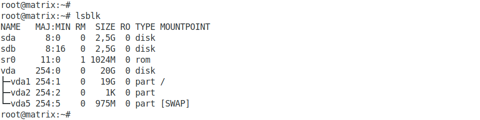
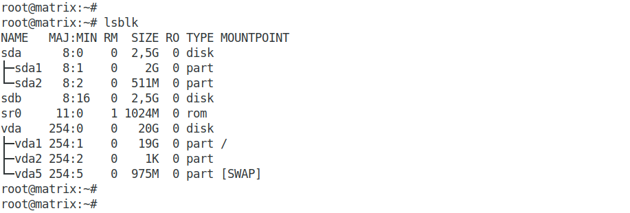
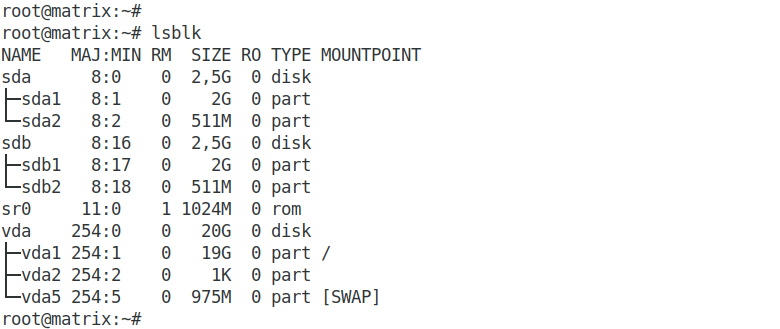

## Домашнее задание к занятию "3.5. Файловые системы  

### 1. Узнайте о sparse (разряженных) файлах.  

Разрежённый файл (англ. sparse file) — файл, в котором последовательности нулевых байтов[1] заменены на информацию об этих последовательностях (список дыр).  
Дыра (англ. hole) — последовательность нулевых байт внутри файла, не записанная на диск. Информация о дырах (смещение от начала файла в байтах и количество байт) хранится в метаданных ФС.  

Преимущества:  

- экономия дискового пространства. Использование разрежённых файлов считается одним из способов сжатия данных на уровне файловой системы;  
- отсутствие временных затрат на запись нулевых байт;  
- увеличение срока службы запоминающих устройств.  

Недостатки:  

- накладные расходы на работу со списком дыр;  
- фрагментация файла при частой записи данных в дыры;  
- невозможность записи данных в дыры при отсутствии свободного места на диске;  
- невозможность использования других индикаторов дыр, кроме нулевых байт.  

### 2. Могут ли файлы, являющиеся жесткой ссылкой на один объект, иметь разные права доступа и владельца? Почему?  

Так как hardlink это ссылка на тот же самый файл и имеет тот же inode то права будут одни и теже.

### 3. Сделайте vagrant destroy на имеющийся инстанс Ubuntu. Замените содержимое Vagrantfile содержимым из задания. Данная конфигурация создаст новую виртуальную машину с двумя дополнительными неразмеченными дисками по 2.5 Гб.

Два диска добавлены к ВМ:  

  

### 4. Используя fdisk, разбейте первый диск на 2 раздела: 2 Гб, оставшееся пространство.  

Диск *_/dev/sda_* разбит на два раздела:  

  

### 5. Используя sfdisk, перенесите данную таблицу разделов на второй диск.  

Перенос выполняю командами:  
*_sfdisk -d /dev/sda > ./partitions-sda.txt_*  
*_sfdisk /dev/sdb < partitions-sda.txt_*  

Результат:  

  

### 6. Соберите mdadm RAID1 на паре разделов 2 Гб.  

