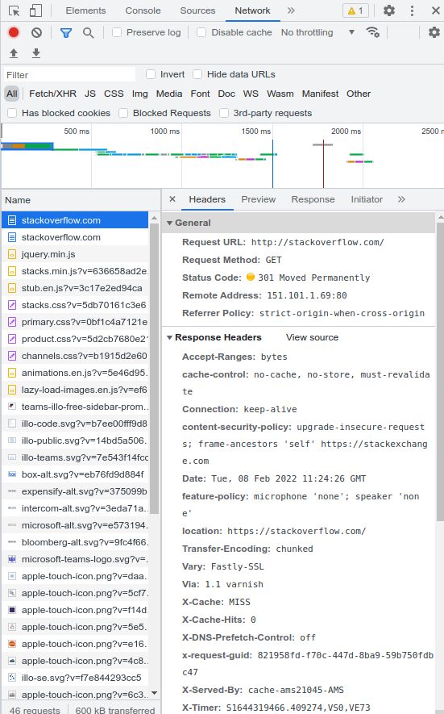
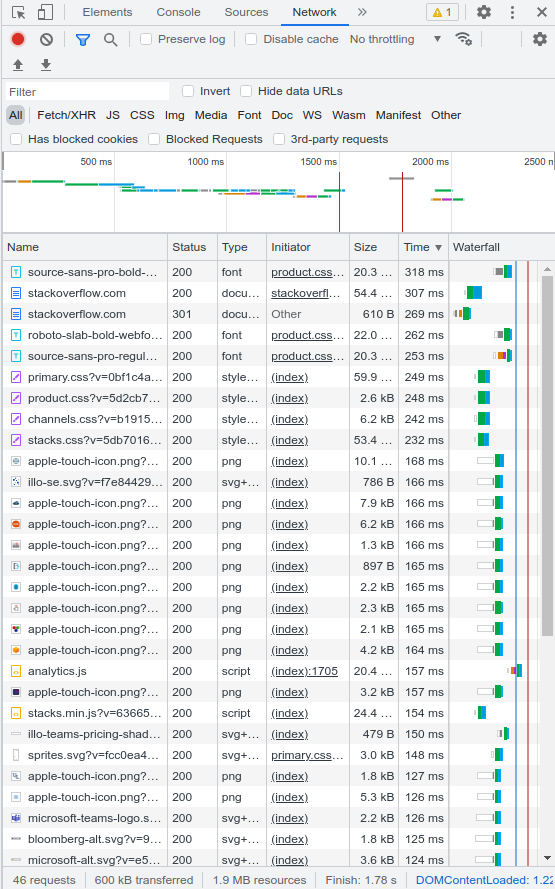
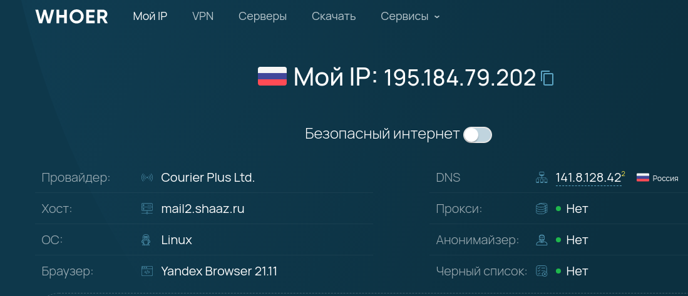
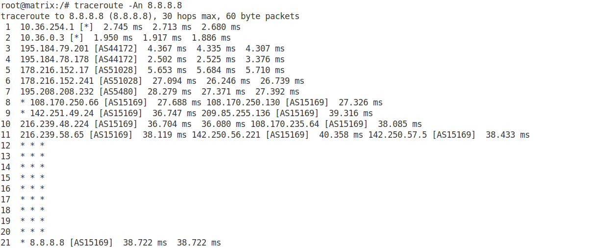

## Домашнее задание к занятию "3.6. Компьютерные сети, лекция 1"  

### 1. Работа c HTTP через телнет.
### Подключитесь утилитой телнет к сайту stackoverflow.com telnet stackoverflow.com 80
### отправьте HTTP запрос
### GET /questions HTTP/1.0
### HOST: stackoverflow.com
### В ответе укажите полученный HTTP код, что он означает?

Полученный ответ:  
**_HTTP/1.1 301 Moved Permanently_**  
**_cache-control: no-cache, no-store, must-revalidate_**  
**_location: https://stackoverflow.com/questions_**  

На сервере настроен редирект с HTTP на HTTPS.  

### 2. Повторите задание 1 в браузере, используя консоль разработчика F12.  

**_Код ответа 301_**  

  

**_Дольше всего выполнялась загрузка шрифта : https://cdn.sstatic.net/Fonts/source-sans-pro/source-sans-pro-bold-webfont.woff?v=f52ccc0bbce9_**  

  

### 3. Какой IP адрес у вас в интернете?  

  

### 4. Какому провайдеру принадлежит ваш IP адрес? Какой автономной системе AS? Воспользуйтесь утилитой whois.  

Команда *_$ whois  195.184.79.202_*  
...  
**_route:          195.184.78.0/23_**  
**_descr:          Courier Plus ISP Ltd._**  
**_origin:         AS44172_**  
**_mnt-by:         MNT-COURIER-PLUS_**  

### 5. Через какие сети проходит пакет, отправленный с вашего компьютера на адрес 8.8.8.8? Через какие AS? Воспользуйтесь утилитой traceroute.  

  

### 6. Повторите задание 5 в утилите mtr. На каком участке наибольшая задержка - delay?  

