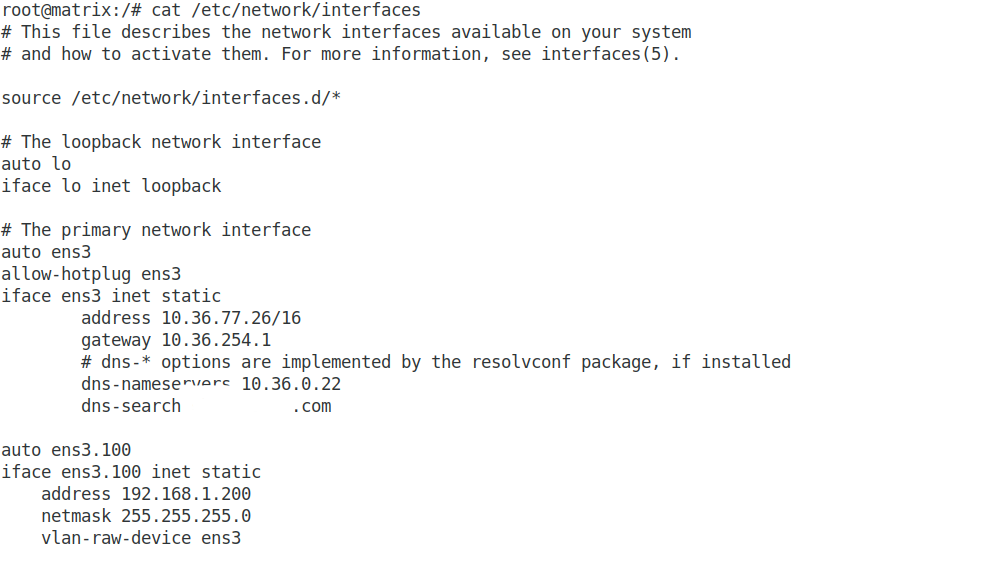

## Домашнее задание к занятию "3.7. Компьютерные сети, лекция 2"  

### 1. Проверьте список доступных сетевых интерфейсов на вашем компьютере. Какие команды есть для этого в Linux и в Windows?  

Команды для вывода списка сетевых интерфесов:  
- Linux - ifconfig, ip a  
- Windows - ipconfig

  

### 2. Какой протокол используется для распознавания соседа по сетевому интерфейсу? Какой пакет и команды есть в Linux для этого?  

Link Layer Discovery Protocol (LLDP) — протокол канального уровня, позволяющий сетевому оборудованию оповещать оборудование, работающее в локальной сети, о своём существовании и передавать ему свои характеристики, а также получать от него аналогичные сведения.  

В Linux пакет *_lldpd_*, утилита *_lldpctl_*.  

### 3. Какая технология используется для разделения L2 коммутатора на несколько виртуальных сетей? Какой пакет и команды есть в Linux для этого? Приведите пример конфига.  

Технология *_VLAN_*.  
Пакет в Linux - *_vlan_*.  

Настройка в среде Debian 11:

Загружаю модуль 8021q:  
*_modprobe 8021q_*  

Добавляю в *_/etc/network/interfaces_* блок vlan:  

  

Рестартую сеть:  
*_/etc/init.d/networking restart_*  

Конфигурация интерфейсов:  

  

### 4. Какие типы агрегации интерфейсов есть в Linux? Какие опции есть для балансировки нагрузки? Приведите пример конфига.  

Типы агрегации (объединения) интерфейсов в Linux:  
mode=0 (balance-rr)  
Этот режим используется по-умолчанию, если в настройках не указано другое. balance-rr обеспечивает балансировку нагрузки и отказоустойчивость. В данном режиме пакеты отправляются "по кругу" от первого интерфейса к последнему и сначала. Если выходит из строя один из интерфейсов, пакеты отправляются на остальные оставшиеся.При подключении портов к разным коммутаторам, требует их настройки.  

mode=1 (active-backup)  
При active-backup один интерфейс работает в активном режиме, остальные в ожидающем. Если активный падает, управление передается одному из ожидающих. Не требует поддержки данной функциональности от коммутатора.  

mode=2 (balance-xor)  
Передача пакетов распределяется между объединенными интерфейсами по формуле ((MAC-адрес источника) XOR (MAC-адрес получателя)) % число интерфейсов. Один и тот же интерфейс работает с определённым получателем. Режим даёт балансировку нагрузки и отказоустойчивость.  

mode=3 (broadcast)  
Происходит передача во все объединенные интерфейсы, обеспечивая отказоустойчивость.  

mode=4 (802.3ad)  
Это динамическое объединение портов. В данном режиме можно получить значительное увеличение пропускной способности как входящего так и исходящего трафика, используя все объединенные интерфейсы. Требует поддержки режима от коммутатора, а так же (иногда) дополнительную настройку коммутатора.  

mode=5 (balance-tlb)  
Адаптивная балансировка нагрузки. При balance-tlb входящий трафик получается только активным интерфейсом, исходящий - распределяется в зависимости от текущей загрузки каждого интерфейса. Обеспечивается отказоустойчивость и распределение нагрузки исходящего трафика. Не требует специальной поддержки коммутатора.  

mode=6 (balance-alb)  
Адаптивная балансировка нагрузки (более совершенная). Обеспечивает балансировку нагрузки как исходящего (TLB, transmit load balancing), так и входящего трафика (для IPv4 через ARP). Не требует специальной поддержки коммутатором, но требует возможности изменять MAC-адрес устройства.  

Настройка агрегации в Debian 11:  
Загружаю модуль:  
*_modprobe bonding_*  

Делаю агрегацию интерфейсов (будет действовать до перезагрузки):  
*_ip link add bond0 type bond mode 802.3ad_*  
*_ip link set eth0 master bond0_*  
*_ip link set eth1 master bond0_*  
  
### 5. Сколько IP адресов в сети с маской /29 ? Сколько /29 подсетей можно получить из сети с маской /24. Приведите несколько примеров /29 подсетей внутри сети 10.10.10.0/24.  

В сети /29 используется 8 IP-адресов, для адресации хостов можно использовать 6 IP-адресов.  
  

Из сети /24  можно получить 32 сети с маской /29.  

Примеры:  
  
  

### 6. Задача: вас попросили организовать стык между 2-мя организациями. Диапазоны 10.0.0.0/8, 172.16.0.0/12, 192.168.0.0/16 уже заняты. Из какой подсети допустимо взять частные IP адреса? Маску выберите из расчета максимум 40-50 хостов внутри подсети.  

Требуется использовать сеть 100.64.0.0/10  

Расчёт нужной подсети:  
  

### 7. Как проверить ARP таблицу в Linux, Windows? Как очистить ARP кеш полностью? Как из ARP таблицы удалить только один нужный IP?  

Проверка arp-таблицы в Windows:  
arp -a  

Проверка arp-таблицы в linux:  
**_arp -n_**  
  

Полная очистка arp-таблицы:  
**_ip link set arp off dev ens3 ; ip link set arp on dev ens3_**  

Удаление одного IP из arp-таблицы:  
**_arp -d 10.36.0.22_**  
  

