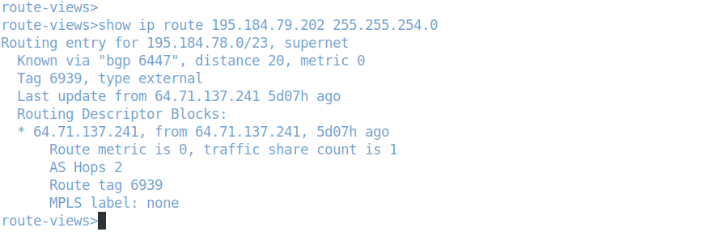
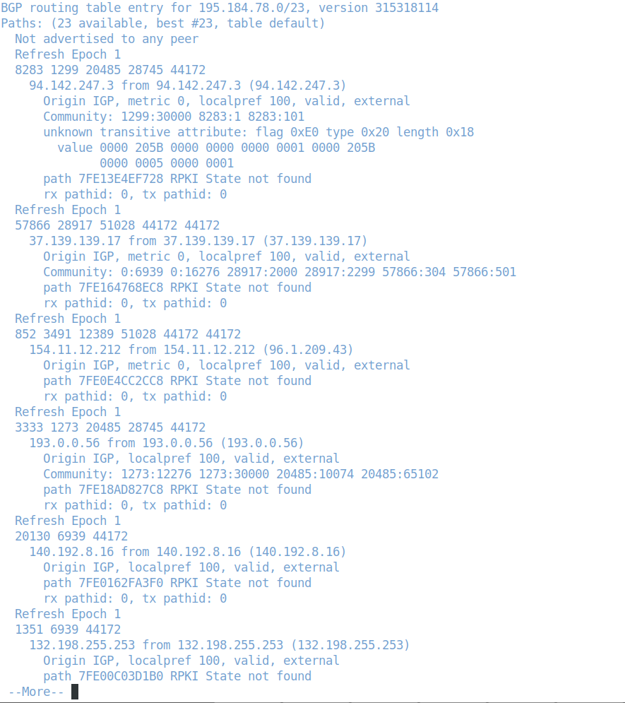
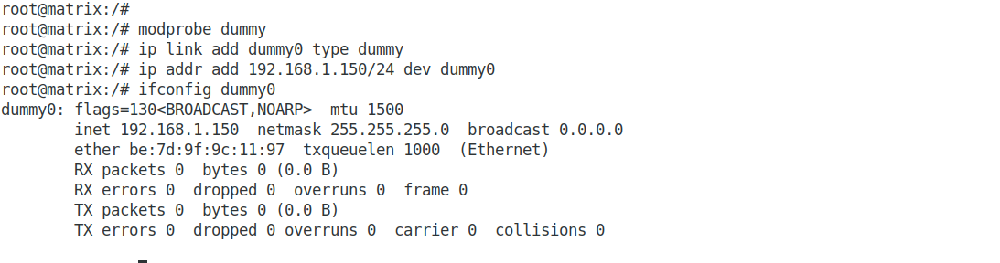
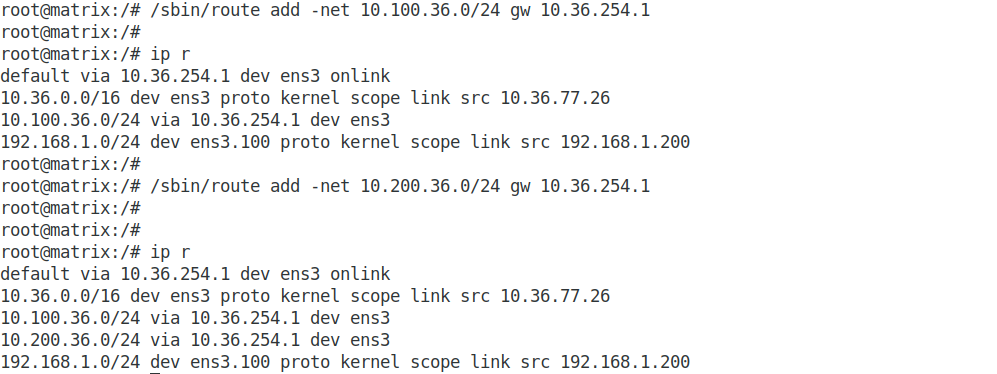
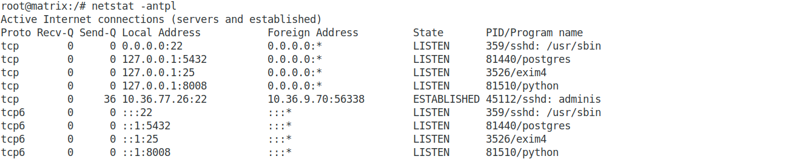
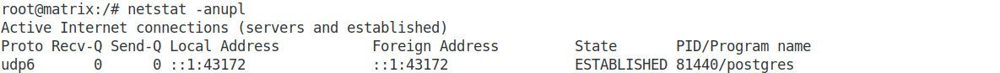
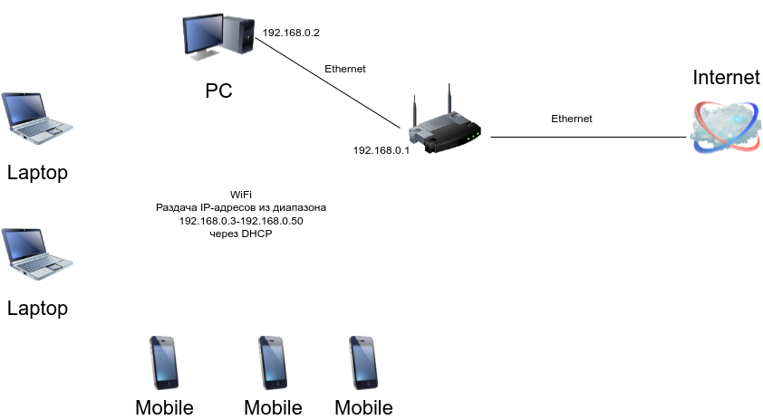

## Домашнее задание к занятию "3.8. Компьютерные сети, лекция 3"  

### 1. Подключитесь к публичному маршрутизатору в интернет. Найдите маршрут к вашему публичному IP  
### telnet route-views.routeviews.org  
### Username: rviews  
### show ip route x.x.x.x/32  
### show bgp x.x.x.x/32  

  

  

### 2. Создайте dummy0 интерфейс в Ubuntu. Добавьте несколько статических маршрутов. Проверьте таблицу маршрутизации.  

Добавил dummy-интерфейс:  
  

Добавил статические маршруты:  
  

### 3. Проверьте открытые TCP порты в Ubuntu, какие протоколы и приложения используют эти порты? Приведите несколько примеров.  

  

Наружу открыт порт 22 - SSH.  
Локально доступны порты:  
- 25 - SMTP(exim);
- 5432 - PostgreSQL;
- 8008 - приложение на python.

### 4. Проверьте используемые UDP сокеты в Ubuntu, какие протоколы и приложения используют эти порты?  

  

Локально доступен порт 43172 - PostgreSQL.  

### 5. Используя diagrams.net, создайте L3 диаграмму вашей домашней сети или любой другой сети, с которой вы работали.  

  
