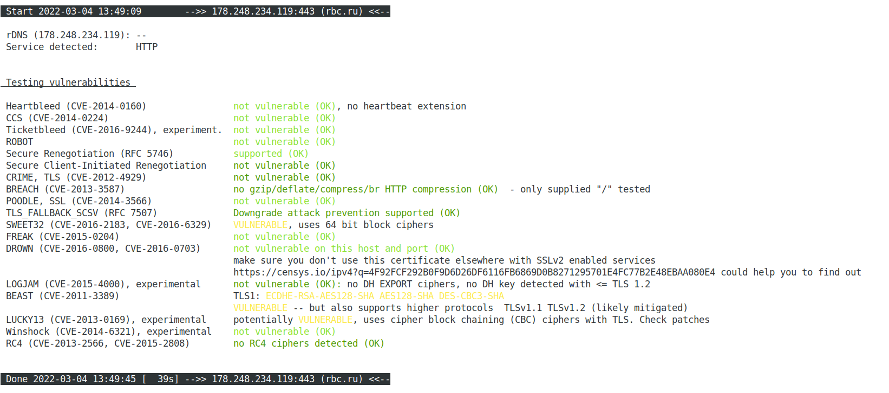

## Домашнее задание к занятию "3.9. Элементы безопасности информационных систем"

### 1. Установите Bitwarden плагин для браузера. Зарегестрируйтесь и сохраните несколько паролей.

### 2. Установите Google authenticator на мобильный телефон. Настройте вход в Bitwarden акаунт через Google authenticator OTP.

### 3. Установите apache2, сгенерируйте самоподписанный сертификат, настройте тестовый сайт для работы по HTTPS.

Ставлю apache:  
*_apt-get update_*  
*_apt-get upgrade_*  
*_apt-get install apache2_*  

Подключаю модуль SSL:  
*_a2enmod ssl_*  
*_systemctl restart apache2_*

Создаю каталог для хранения сертификатов:  
*_mkdir -p /etc/apache2/ssl_*  

Создаю самоподписанный сертификат для сайта _test.ru_:  
*_openssl req -x509 -nodes -days 365 -newkey rsa:2048 -keyout /etc/apache2/ssl/test.ru.key -out /etc/apache2/ssl/test.ru.crt_*  

В качестве Common Name указываю _test.ru_  

Создаю файлы конфигурации Apache для работы домена test.ru.  

На скриншоте файл конфигуриции для работы сайта по https://  
..
  

### 4. Проверьте на TLS уязвимости произвольный сайт в интернете (кроме сайтов МВД, ФСБ, МинОбр, НацБанк, РосКосмос, РосАтом, РосНАНО и любых госкомпаний, объектов КИИ, ВПК ... и тому подобное).  

Провожу проверку сайта **_rbc.ru_**:  

*_./testssl.sh -U --sneaky https://rbc.ru/_*  

Результат проверки:  

  

## 5. Установите на Ubuntu ssh сервер, сгенерируйте новый приватный ключ. Скопируйте свой публичный ключ на другой сервер. Подключитесь к серверу по SSH-ключу.  

Генерация приватного ключа:  
*_ssh-keygen_*  

Копирование публичного ключа на другой сервер:  

*_ssh-copy-id root@10.36.0.50_*  

Доступ по SSH-ключу:  

  

## 6. Переименуйте файлы ключей из задания 5. Настройте файл конфигурации SSH клиента, так чтобы вход на удаленный сервер осуществлялся по имени сервера.  

Файл конфигурации ~/.ssh/config:  

Host imperior  
User root  
HostName 10.36.0.50  
Port 22  
IdentityFile ~/.ssh/id_rsa_imp  

Подключенние по SSH к хосту по имени:  

  

