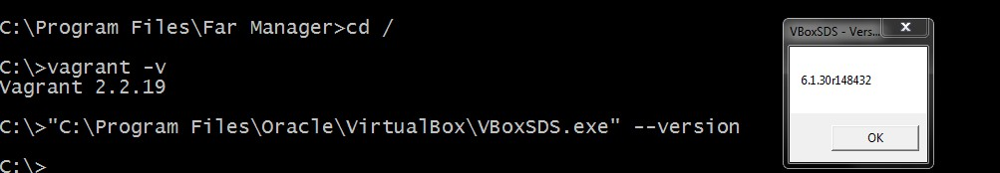

## Домашнее задание к занятию "5.2. Применение принципов IaaC в работе с виртуальными машинами"  

### Задача 1  
1. Опишите своими словами основные преимущества применения на практике IaaC паттернов.  
- IaC позволяет быстрее конфигурировать инфраструктуру для разработки, тестирования и эксплуатации, ускоряя вывод продукта на рынок.  
- Развертывания инфраструктуры с помощью IaC повторяемы и предотвращают проблемы во время выполнения, вызванных дрейфом конфигурации или отсутствием зависимостей.  
- Более быстрая и эффективная разработка за счет CI/CD  

2. Какой из принципов IaaC является основополагающим?  
Главное преимущество IaaC - *_Идемпотентность_*, свойство объекта или операции при повторном применении операции к объекту давать тот же результат, что и при первом.  

### Задача 2  
1. Чем Ansible выгодно отличается от других систем управление конфигурациями?  
*_Ansible_* не требует наличия агента на клиенте, позволяет использовать существующую SSH инфраструктуру, большое количество модулей.

2. Какой, на ваш взгляд, метод работы систем конфигурации более надёжный push или pull?  
В Pull-системе клиенты связываются с сервером независимо друг от друга, поэтому система в целом более масштабируема, чем Push-система.  

### Задача 3  
Установить на личный компьютер:

- VirtualBox  
- Vagrant  

  

- Ansible  

```
# ansible --version
ansible 2.9.27
  config file = /etc/ansible/ansible.cfg
  configured module search path = [u'/root/.ansible/plugins/modules', u'/usr/share/ansible/plugins/modules']
  ansible python module location = /usr/lib/python2.7/dist-packages/ansible
  executable location = /usr/bin/ansible
  python version = 2.7.16 (default, Oct 10 2019, 22:02:15) [GCC 8.3.0]

```

*_Приложить вывод команд установленных версий каждой из программ, оформленный в markdown._*

