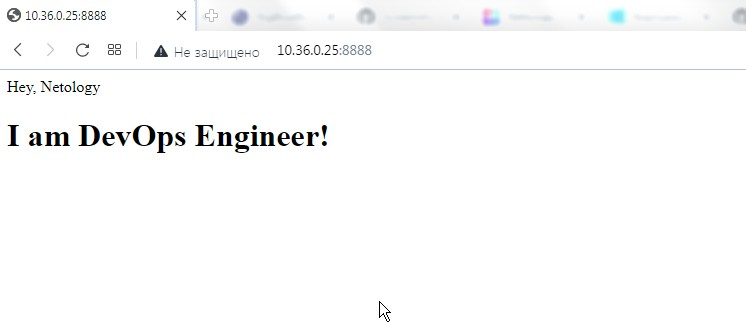
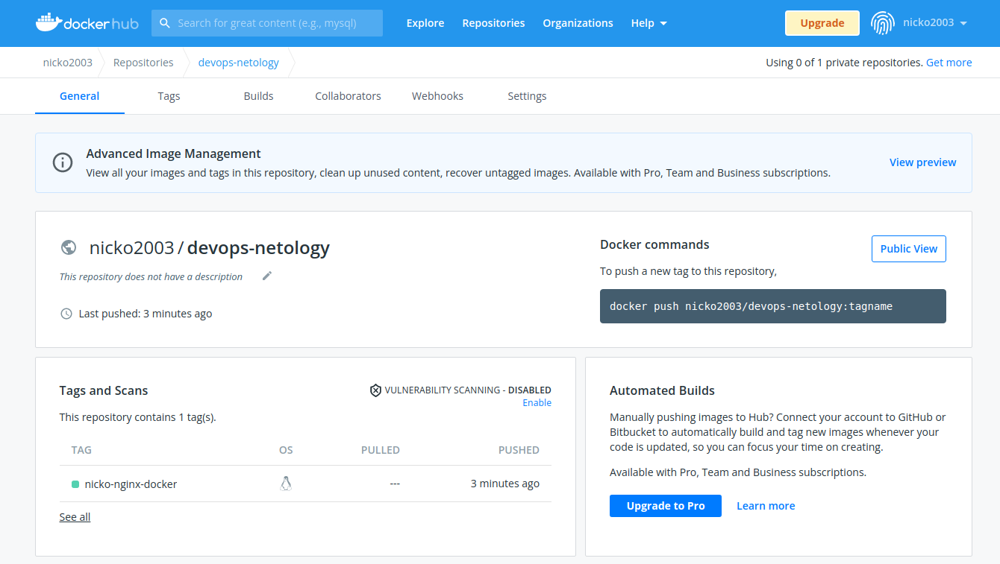

## Домашнее задание к занятию "5.3. Введение. Экосистема. Архитектура. Жизненный цикл Docker контейнера"  

### Задача 1  

Сценарий выполения задачи:  

- создайте свой репозиторий на https://hub.docker.com;  
- выберете любой образ, который содержит веб-сервер Nginx;  
- создайте свой fork образа;  
- реализуйте функциональность: запуск веб-сервера в фоне с индекс-страницей, содержащей HTML-код ниже:  
```
<html>
<head>
Hey, Netology
</head>
<body>
<h1>I’m DevOps Engineer!</h1>
</body>
</html>
```
Опубликуйте созданный форк в своем репозитории и предоставьте ответ в виде ссылки на https://hub.docker.com/username_repo.  

### Решение.  
На сервер с Debian 11 устанавливаю Docker:  

- Обновление пакетов:  
```bash
# apt-get update & apt-get upgrade
```  

- Установка пакетов, позволяющих работать apt через HTTPS:  
```bash
# apt-get install apt-transport-https ca-certificates curl gnupg2 software-properties-common
```

- Добавление GPG ключа:  
```bash
# curl -fsSL https://download.docker.com/linux/debian/gpg | apt-key add -
```

- Подключение стабильного (stable) репозитория docker:  
```bash
# add-apt-repository "deb [arch=amd64] https://download.docker.com/linux/debian $(lsb_release -cs) stable"
```

- Установка Docker:  
```bash
# apt-get update
# apt-get install docker-ce docker-ce-cli containerd.io
```  

- Получаю официальный образ nginx:  
```bash
# docker pull nginx
```
- Создаю рабочий каталог:  
```bash
# mkdir -p ~/netology/nicko-nginx-docker
```

- Создаю индексный файл _*index.html*_:  
```bash
# touch ~/netology/nicko-nginx-docker/index.html
```

- Создаю Dockerfile:  
```bash
# touch ~/netology/nicko-nginx-docker/Dockerfile
```
- В Dockerfile вставляю следующие команды:  
Первой командой *_FROM_*  создаю собственный образ, используя базовый образ.  Это вытянет nginx-образ на локальную машину, а затем создаст собственный образ поверх него.  
Команда COPY помешает файл index.html в /usr/share/nginx/html каталог внутри контейнера и перезаписывает файл по умолчанию index.html , предоставленный nginx-образом.  
```
FROM nginx
COPY ./index.html /usr/share/nginx/html/index.html
```

- Собираю собственный образ:  
```bash
# docker build -t nicko-nginx-docker .
```
Вывод команды:  
```
Sending build context to Docker daemon  3.072kB
Step 1/2 : FROM nginx:latest
 ---> de2543b9436b
Step 2/2 : COPY ./index.html /usr/share/nginx/html/index.html
 ---> a70f2e4ed111
Successfully built a70f2e4ed111
Successfully tagged nicko-nginx-docker:latest
```
Образ собран:  
```bash
# docker images
REPOSITORY           TAG       IMAGE ID       CREATED              SIZE
nicko-nginx-docker   latest    39524532c421   3 minutes ago        142MB
nginx                latest    de2543b9436b   29 hours ago         142MB
hello-world          latest    feb5d9fea6a5   7 months ago         13.3kB
```

- Стартую контейнер:  
```bash
# docker run -d -p 8888:80 --name web nicko-nginx-docker
741dbeb8f22d62d470f12ab5c2ea894fd524e8173504de7d0f70e74827dd8d92
```
Проверяю:  
```bash
# docker ps
CONTAINER ID   IMAGE                COMMAND                  CREATED              STATUS              PORTS                                   NAMES
741dbeb8f22d   nicko-nginx-docker   "/docker-entrypoint.…"   About a minute ago   Up About a minute   0.0.0.0:8888->80/tcp, :::8888->80/tcp   web
```  
Проверяю в браузере:  
  
  
  
- Размещаю собственный образ nginx в репозитории docker:  
Логинюсь:  
```bash
# docker login
```
   
Устанавливаю tag:  
```bash
# docker tag nicko-nginx-docker nicko2003/devops-netology:nicko-nginx-docker
```  
Загружаю образ в репозиторий:  
```bash
# docker push nicko2003/devops-netology:nicko-nginx-docker
The push refers to repository [docker.io/nicko2003/devops-netology]
ca5fc0181534: Pushed 
a059c9abe376: Pushed 
09be960dcde4: Pushed 
18be1897f940: Pushed 
dfe7577521f0: Pushed 
d253f69cb991: Pushed 
fd95118eade9: Pushed 
nicko-nginx-docker: digest: sha256:44199922035dff2ed936d519550b8d7f72fe4aeee892364a6cb84bf2f65a9c87 size: 1777
```
  
  
  

### Задача 2  

Посмотрите на сценарий ниже и ответьте на вопрос: "Подходит ли в этом сценарии использование Docker контейнеров или лучше подойдет виртуальная машина, физическая машина? Может быть возможны разные варианты?"

Детально опишите и обоснуйте свой выбор.

--

Сценарий:  

- Высоконагруженное монолитное java веб-приложение;  
- Nodejs веб-приложение;  
- Мобильное приложение c версиями для Android и iOS;  
- Шина данных на базе Apache Kafka;  
- Elasticsearch кластер для реализации логирования продуктивного веб-приложения - три ноды elasticsearch, два logstash и две ноды kibana;  
- Мониторинг-стек на базе Prometheus и Grafana;  
- MongoDB, как основное хранилище данных для java-приложения;  
- Gitlab сервер для реализации CI/CD процессов и приватный (закрытый) Docker Registry.  

### Задача 3  

- Запустите первый контейнер из образа centos c любым тэгом в фоновом режиме, подключив папку /data из текущей рабочей директории на хостовой машине в /data контейнера;  
- Запустите второй контейнер из образа debian в фоновом режиме, подключив папку /data из текущей рабочей директории на хостовой машине в /data контейнера;  
- Подключитесь к первому контейнеру с помощью docker exec и создайте текстовый файл любого содержания в /data;  
- Добавьте еще один файл в папку /data на хостовой машине;  
- Подключитесь во второй контейнер и отобразите листинг и содержание файлов в /data контейнера.  
