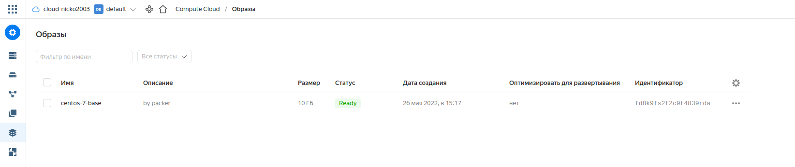
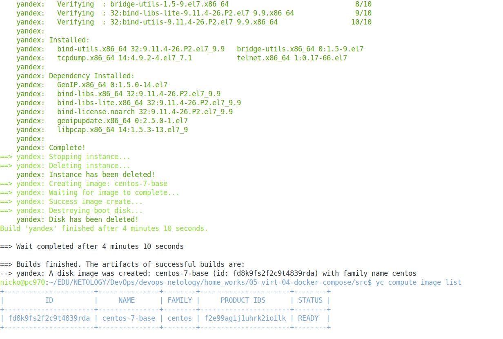
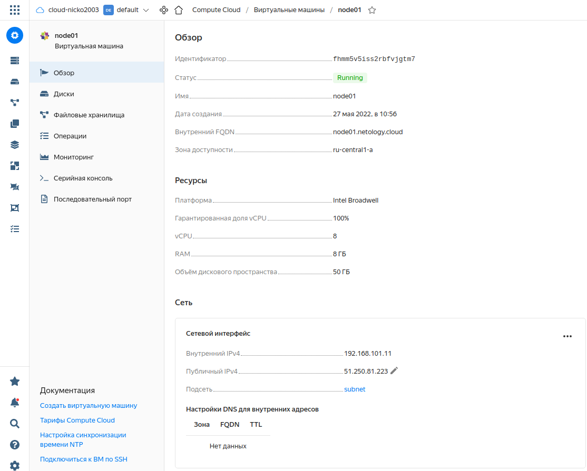
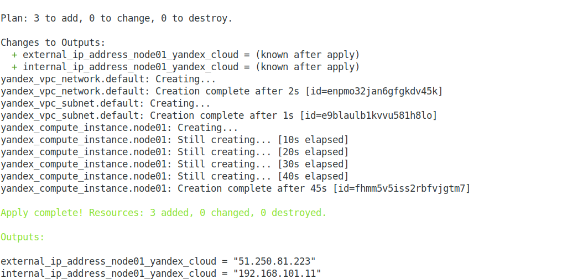
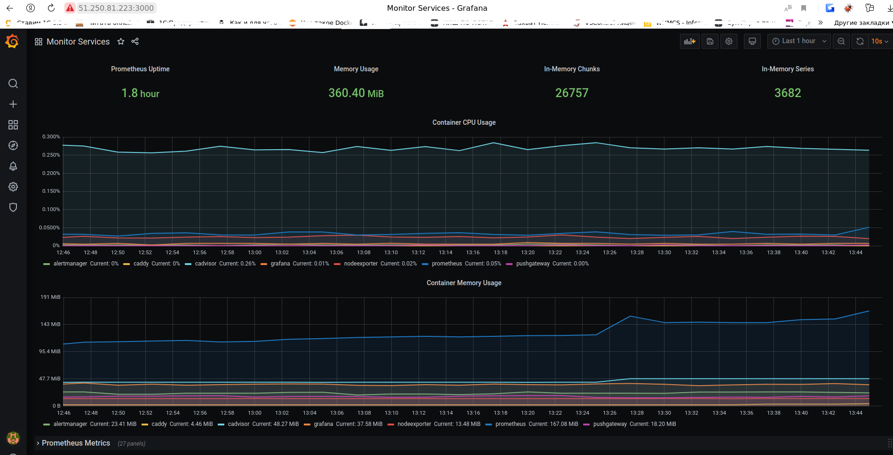

## Домашнее задание к занятию "5.4. Оркестрация группой Docker контейнеров на примере Docker Compose"  

### Задача 1.  
Создать собственный образ операционной системы с помощью Packer.  
Для получения зачета, вам необходимо предоставить: cкриншот страницы, как на слайде из презентации (слайд 37).  

### Ответ:  

Скриншот консоли Yandex.Cloud:  

  

Процесс выполнения команды сборки образа  :  
```bash
$ packer build centos-7-base.json
```

  


### Задача 2.  
Создать вашу первую виртуальную машину в Яндекс.Облаке.  

### Ответ:  

Скриншот консоли Yandex.Cloud:  

  

Процесс выполнения команды запуска ВМ :  
```bash
$ terraform init
$ terraform validate
$ terraform plan
$ terraform apply -auto-approve
```
  
  


### Задача 3.  
Создать ваш первый готовый к боевой эксплуатации компонент мониторинга, состоящий из стека микросервисов.  
Для получения зачета, вам необходимо предоставить: скриншот работающего веб-интерфейса Grafana с текущими метриками.  

### Ответ:  

  

