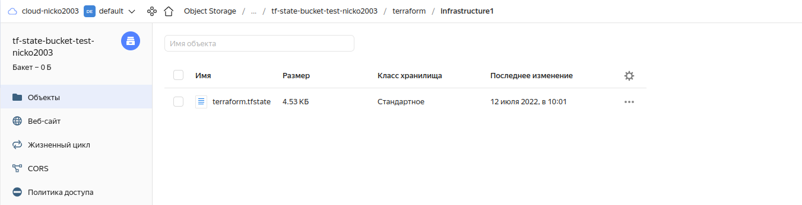

# Домашнее задание к занятию "7.3. Основы и принцип работы Терраформ"

## Задача 1. Создадим бэкэнд в S3 (необязательно, но крайне желательно).

Если в рамках предыдущего задания у вас уже есть аккаунт AWS, то давайте продолжим знакомство со взаимодействием
терраформа и aws. 

1. Создайте s3 бакет, iam роль и пользователя от которого будет работать терраформ. Можно создать отдельного пользователя,
а можно использовать созданного в рамках предыдущего задания, просто добавьте ему необходимы права, как описано 
[здесь](https://www.terraform.io/docs/backends/types/s3.html).
1. Зарегистрируйте бэкэнд в терраформ проекте как описано по ссылке выше. 

## Решение.  

Выполняю в Yandex Cloud.  

Определяю файлы Terraform для создания S3 бакета:  

- variables.tf  
```bash
variable "yandex_cloud_id" {
  default = "b1gusbu5rl5peuirh6d4"
}

variable "yandex_folder_id" {
  default = "b1giv01e8j41n6fkprqq"
}

```

- provider.tf  
```bash
terraform {
  required_providers {
    yandex = {
      source = "yandex-cloud/yandex"
    }
  }
  required_version = ">= 0.13"
}

provider "yandex" {
  #  token     = "<OAuth>"  Load from environment var YC_TOKEN

# Load from variables.tf
  cloud_id  = "${var.yandex_cloud_id}"
  folder_id = "${var.yandex_folder_id}"

  zone      = "ru-central1-a"
}
```

- outputs.tf  
Делается для получения значений аргументов access_key и secret_key и сохранения данных значений в файле состояния. Если access_key можно посмотреть в панели Яндекса, то secret_key мы увидеть не можем.
```bash
output "access_key" {
  value = yandex_iam_service_account_static_access_key.sa-static-key.access_key
  sensitive = true
}
output "secret_key" {
  value = yandex_iam_service_account_static_access_key.sa-static-key.secret_key
  sensitive = true
}
```

- s3.tf  
Создаю сервисный аккаунт с ролью storage.editor, получаю ключи для сервисного аккаунта, создаю бакет.  
```bash
resource "yandex_iam_service_account" "s3" {
  folder_id = "${var.yandex_folder_id}"
  name      = "s3-nicko2003"
}

resource "yandex_resourcemanager_folder_iam_member" "sa-editor" {
  folder_id = "${var.yandex_folder_id}"
  role      = "storage.editor"
  member    = "serviceAccount:${yandex_iam_service_account.s3.id}"
}

resource "yandex_iam_service_account_static_access_key" "sa-static-key" {
  service_account_id = yandex_iam_service_account.s3.id
  description        = "Static access key for object storage"
}

resource "yandex_storage_bucket" "state-nicko2003" {
  bucket     = "tf-state-bucket-test-nicko2003"
  access_key = yandex_iam_service_account_static_access_key.sa-static-key.access_key
  secret_key = yandex_iam_service_account_static_access_key.sa-static-key.secret_key
}

```

Регистрирую бэкэнд в терраформ проекте, для этого корректирую файл provider.tf, добавляю секцию backend "s3":  
```bash
terraform {
  required_providers {
    yandex = {
      source = "yandex-cloud/yandex"
    }
  }
  required_version = ">= 0.13"


  backend "s3" {
    endpoint   = "storage.yandexcloud.net"
    bucket     = "tf-state-bucket-test-nicko2003"
    region     = "ru-central1-a"
    key        = "terraform/infrastructure1/terraform.tfstate"
    access_key = "YCA...NBd"
    secret_key = "YCP...4pS"

    skip_region_validation      = true
    skip_credentials_validation = true
  }

}

provider "yandex" {
  #  token     = "<OAuth>"  Load from environment var YC_TOKEN

# Load from variables.tf
  cloud_id  = "${var.yandex_cloud_id}"
  folder_id = "${var.yandex_folder_id}"

  zone      = "ru-central1-a"
}
```

## Задача 2. Инициализируем проект и создаем воркспейсы. 

1. Выполните `terraform init`:
    * если был создан бэкэнд в S3, то терраформ создат файл стейтов в S3 и запись в таблице 
dynamodb.
    * иначе будет создан локальный файл со стейтами.  
1. Создайте два воркспейса `stage` и `prod`.
1. В уже созданный `aws_instance` добавьте зависимость типа инстанса от вокспейса, что бы в разных ворскспейсах 
использовались разные `instance_type`.
1. Добавим `count`. Для `stage` должен создаться один экземпляр `ec2`, а для `prod` два. 
1. Создайте рядом еще один `aws_instance`, но теперь определите их количество при помощи `for_each`, а не `count`.
1. Что бы при изменении типа инстанса не возникло ситуации, когда не будет ни одного инстанса добавьте параметр
жизненного цикла `create_before_destroy = true` в один из рессурсов `aws_instance`.
1. При желании поэкспериментируйте с другими параметрами и рессурсами.

В виде результата работы пришлите:
* Вывод команды `terraform workspace list`.
* Вывод команды `terraform plan` для воркспейса `prod`.  

---

## Решение:
- Файл состояния Terraform переезжает в S3:  




- Вывод команды `terraform workspace list`.
```bash
$ terraform workspace list
  default
* prod
  stage

```


<details>
    <summary>Вывод команды `terraform plan` для воркспейса `prod`</summary>

$ terraform apply

Terraform used the selected providers to generate the following execution plan. Resource actions are indicated with the following symbols:
  + create

Terraform will perform the following actions:

  # yandex_compute_instance.vm-01[0] will be created
  + resource "yandex_compute_instance" "vm-01" {
      + allow_stopping_for_update = true
      + created_at                = (known after apply)
      + folder_id                 = (known after apply)
      + fqdn                      = (known after apply)
      + hostname                  = (known after apply)
      + id                        = (known after apply)
      + metadata                  = {
          + "ssh-keys" = <<-EOT
                ubuntu:ssh-rsa AAAAB3NzaC1yc2EAAAADAQABAAACAQDZK9/9+eNPTZpAouurTPlvoHBaV3evuCQ0UZC7RiDv57foUSGbaKNtq7FXPBfsd/leFo0b0wnghR383Z+G6Uky6QPK2nNTqY/xgH0B8xBKlWOn8X0UUoRdAWQjlexpaosjF8cMUzl7TLtuUaA4uVIUA0eP14sYZ3j80gKBFEjZgU9ONkTHlE2vNDRN3FWi8YEr3jRWKEWtZagARsaH85Sf8zimeU2StCy+OR3PUcVisy18Q9tocn2gnch1m/eKZEhdIBQ49LyiLYbFgekAfEVriI4C7oTL9UAyUUsJ1YachUXi6q1q1cyNr1yPoMtZqdk6veLlrJMmyWsFoIxQcgcdEMnLbvSBZiS/uviaxpg44caOs37WAq5Rem3WMREyrbd5yr+Vu/bQHWtrvNzn99tNkryxTXZUWYI+6AvH9+108iMU7lkGqu/mMqIoGx1Stnb3rmBI3euYxb4diViBeTmNOfSE+1/51cM024n5cviAdofZrJ/5pSViYbR8QnOIHXdB04u9NlH9agm8t8ewLm1YsUGHlQ/4EWYvI65Q/yFTPl872cVIY8U0nMQnq/kmLo2XW3AHbBh5x3i28xNi8Rr7m6ymDSyv0XnJ0tPjg0Foxw2HqJ3pR4rrb5LSHJ+C1na59kfpp8NufLZDwzaZ/53J8XT7YSgJH9xN+LuyEjWnGw== nicko@pc970.shaaz.ugmk.com
                ssh-rsa AAAAB3NzaC1yc2EAAAABIwAAAQEAxvtuqIVHwGRGo7ZsbojltshXuepsUkdSrx82CfFRk7MunzoWzN1RG+o714AhhOfPQ6lS/BKpGgqbpyzyFdFacxbcnjOFkpmU/4PRo9SO+bQBLFChkE2I3xi3330uC73WB5kpKINyIEzawNvKaTt4y/dIPSB5HY3KlcekCpFPQd0VSK/M05ducQhDzmcvKq0q4YU8ReC9L5vMY0abUIc+LeoAGzkMZ+JKhdn7P7nJYtCc3R+7zktZ4A2XrS5ys6bEX/p1mymNhIbP4bnTJi7hPCLnTTkFu3UDVIblf0LRlf4c+pG4NRwwSBBzPCRm4r50i/qK/Ywhag0J5Asu3lZlaw==
                ssh-rsa b3BlbnNzaC1rZXktdjEAAAAABG5vbmUAAAAEbm9uZQAAAAAAAAABAAAAMwAAAAtzc2gtZWQyNTUxOQAAACCxXLuqzf2JSGGnUftGlL/7YB2YZREshka1Do4vZKJ6LgAAAJCCgfBcgoHwXAAAAAtzc2gtZWQyNTUxOQAAACCxXLuqzf2JSGGnUftGlL/7YB2YZREshka1Do4vZKJ6LgAAAEA8As2z5BHXdxbsax0DxIm9m7+aHRTjvIXsnEsOFK2lC7Fcu6rN/YlIYadR+0aUv/tgHZhlESyGRrUOji9konouAAAADUZvciBkYiB0dW5pbmc=
            EOT
        }
      + name                      = "nicko2003-vm-01-prod-number-1"
      + network_acceleration_type = "standard"
      + platform_id               = "standard-v1"
      + service_account_id        = (known after apply)
      + status                    = (known after apply)
      + zone                      = (known after apply)

      + boot_disk {
          + auto_delete = true
          + device_name = (known after apply)
          + disk_id     = (known after apply)
          + mode        = (known after apply)

          + initialize_params {
              + block_size  = (known after apply)
              + description = (known after apply)
              + image_id    = "fd81u2vhv3mc49l1ccbb"
              + name        = (known after apply)
              + size        = (known after apply)
              + snapshot_id = (known after apply)
              + type        = "network-hdd"
            }
        }

      + network_interface {
          + index              = (known after apply)
          + ip_address         = (known after apply)
          + ipv4               = true
          + ipv6               = (known after apply)
          + ipv6_address       = (known after apply)
          + mac_address        = (known after apply)
          + nat                = true
          + nat_ip_address     = (known after apply)
          + nat_ip_version     = (known after apply)
          + security_group_ids = (known after apply)
          + subnet_id          = (known after apply)
        }

      + placement_policy {
          + host_affinity_rules = (known after apply)
          + placement_group_id  = (known after apply)
        }

      + resources {
          + core_fraction = 100
          + cores         = 4
          + memory        = 4
        }

      + scheduling_policy {
          + preemptible = (known after apply)
        }
    }

  # yandex_compute_instance.vm-01[1] will be created
  + resource "yandex_compute_instance" "vm-01" {
      + allow_stopping_for_update = true
      + created_at                = (known after apply)
      + folder_id                 = (known after apply)
      + fqdn                      = (known after apply)
      + hostname                  = (known after apply)
      + id                        = (known after apply)
      + metadata                  = {
          + "ssh-keys" = <<-EOT
                ubuntu:ssh-rsa AAAAB3NzaC1yc2EAAAADAQABAAACAQDZK9/9+eNPTZpAouurTPlvoHBaV3evuCQ0UZC7RiDv57foUSGbaKNtq7FXPBfsd/leFo0b0wnghR383Z+G6Uky6QPK2nNTqY/xgH0B8xBKlWOn8X0UUoRdAWQjlexpaosjF8cMUzl7TLtuUaA4uVIUA0eP14sYZ3j80gKBFEjZgU9ONkTHlE2vNDRN3FWi8YEr3jRWKEWtZagARsaH85Sf8zimeU2StCy+OR3PUcVisy18Q9tocn2gnch1m/eKZEhdIBQ49LyiLYbFgekAfEVriI4C7oTL9UAyUUsJ1YachUXi6q1q1cyNr1yPoMtZqdk6veLlrJMmyWsFoIxQcgcdEMnLbvSBZiS/uviaxpg44caOs37WAq5Rem3WMREyrbd5yr+Vu/bQHWtrvNzn99tNkryxTXZUWYI+6AvH9+108iMU7lkGqu/mMqIoGx1Stnb3rmBI3euYxb4diViBeTmNOfSE+1/51cM024n5cviAdofZrJ/5pSViYbR8QnOIHXdB04u9NlH9agm8t8ewLm1YsUGHlQ/4EWYvI65Q/yFTPl872cVIY8U0nMQnq/kmLo2XW3AHbBh5x3i28xNi8Rr7m6ymDSyv0XnJ0tPjg0Foxw2HqJ3pR4rrb5LSHJ+C1na59kfpp8NufLZDwzaZ/53J8XT7YSgJH9xN+LuyEjWnGw== nicko@pc970.shaaz.ugmk.com
                ssh-rsa AAAAB3NzaC1yc2EAAAABIwAAAQEAxvtuqIVHwGRGo7ZsbojltshXuepsUkdSrx82CfFRk7MunzoWzN1RG+o714AhhOfPQ6lS/BKpGgqbpyzyFdFacxbcnjOFkpmU/4PRo9SO+bQBLFChkE2I3xi3330uC73WB5kpKINyIEzawNvKaTt4y/dIPSB5HY3KlcekCpFPQd0VSK/M05ducQhDzmcvKq0q4YU8ReC9L5vMY0abUIc+LeoAGzkMZ+JKhdn7P7nJYtCc3R+7zktZ4A2XrS5ys6bEX/p1mymNhIbP4bnTJi7hPCLnTTkFu3UDVIblf0LRlf4c+pG4NRwwSBBzPCRm4r50i/qK/Ywhag0J5Asu3lZlaw==
                ssh-rsa b3BlbnNzaC1rZXktdjEAAAAABG5vbmUAAAAEbm9uZQAAAAAAAAABAAAAMwAAAAtzc2gtZWQyNTUxOQAAACCxXLuqzf2JSGGnUftGlL/7YB2YZREshka1Do4vZKJ6LgAAAJCCgfBcgoHwXAAAAAtzc2gtZWQyNTUxOQAAACCxXLuqzf2JSGGnUftGlL/7YB2YZREshka1Do4vZKJ6LgAAAEA8As2z5BHXdxbsax0DxIm9m7+aHRTjvIXsnEsOFK2lC7Fcu6rN/YlIYadR+0aUv/tgHZhlESyGRrUOji9konouAAAADUZvciBkYiB0dW5pbmc=
            EOT
        }
      + name                      = "nicko2003-vm-01-prod-number-2"
      + network_acceleration_type = "standard"
      + platform_id               = "standard-v1"
      + service_account_id        = (known after apply)
      + status                    = (known after apply)
      + zone                      = (known after apply)

      + boot_disk {
          + auto_delete = true
          + device_name = (known after apply)
          + disk_id     = (known after apply)
          + mode        = (known after apply)

          + initialize_params {
              + block_size  = (known after apply)
              + description = (known after apply)
              + image_id    = "fd81u2vhv3mc49l1ccbb"
              + name        = (known after apply)
              + size        = (known after apply)
              + snapshot_id = (known after apply)
              + type        = "network-hdd"
            }
        }

      + network_interface {
          + index              = (known after apply)
          + ip_address         = (known after apply)
          + ipv4               = true
          + ipv6               = (known after apply)
          + ipv6_address       = (known after apply)
          + mac_address        = (known after apply)
          + nat                = true
          + nat_ip_address     = (known after apply)
          + nat_ip_version     = (known after apply)
          + security_group_ids = (known after apply)
          + subnet_id          = (known after apply)
        }

      + placement_policy {
          + host_affinity_rules = (known after apply)
          + placement_group_id  = (known after apply)
        }

      + resources {
          + core_fraction = 100
          + cores         = 4
          + memory        = 4
        }

      + scheduling_policy {
          + preemptible = (known after apply)
        }
    }

  # yandex_compute_instance.vm-02["prod01"] will be created
  + resource "yandex_compute_instance" "vm-02" {
      + allow_stopping_for_update = true
      + created_at                = (known after apply)
      + folder_id                 = (known after apply)
      + fqdn                      = (known after apply)
      + hostname                  = (known after apply)
      + id                        = (known after apply)
      + metadata                  = {
          + "ssh-keys" = <<-EOT
                ubuntu:ssh-rsa AAAAB3NzaC1yc2EAAAADAQABAAACAQDZK9/9+eNPTZpAouurTPlvoHBaV3evuCQ0UZC7RiDv57foUSGbaKNtq7FXPBfsd/leFo0b0wnghR383Z+G6Uky6QPK2nNTqY/xgH0B8xBKlWOn8X0UUoRdAWQjlexpaosjF8cMUzl7TLtuUaA4uVIUA0eP14sYZ3j80gKBFEjZgU9ONkTHlE2vNDRN3FWi8YEr3jRWKEWtZagARsaH85Sf8zimeU2StCy+OR3PUcVisy18Q9tocn2gnch1m/eKZEhdIBQ49LyiLYbFgekAfEVriI4C7oTL9UAyUUsJ1YachUXi6q1q1cyNr1yPoMtZqdk6veLlrJMmyWsFoIxQcgcdEMnLbvSBZiS/uviaxpg44caOs37WAq5Rem3WMREyrbd5yr+Vu/bQHWtrvNzn99tNkryxTXZUWYI+6AvH9+108iMU7lkGqu/mMqIoGx1Stnb3rmBI3euYxb4diViBeTmNOfSE+1/51cM024n5cviAdofZrJ/5pSViYbR8QnOIHXdB04u9NlH9agm8t8ewLm1YsUGHlQ/4EWYvI65Q/yFTPl872cVIY8U0nMQnq/kmLo2XW3AHbBh5x3i28xNi8Rr7m6ymDSyv0XnJ0tPjg0Foxw2HqJ3pR4rrb5LSHJ+C1na59kfpp8NufLZDwzaZ/53J8XT7YSgJH9xN+LuyEjWnGw== nicko@pc970.shaaz.ugmk.com
                ssh-rsa AAAAB3NzaC1yc2EAAAABIwAAAQEAxvtuqIVHwGRGo7ZsbojltshXuepsUkdSrx82CfFRk7MunzoWzN1RG+o714AhhOfPQ6lS/BKpGgqbpyzyFdFacxbcnjOFkpmU/4PRo9SO+bQBLFChkE2I3xi3330uC73WB5kpKINyIEzawNvKaTt4y/dIPSB5HY3KlcekCpFPQd0VSK/M05ducQhDzmcvKq0q4YU8ReC9L5vMY0abUIc+LeoAGzkMZ+JKhdn7P7nJYtCc3R+7zktZ4A2XrS5ys6bEX/p1mymNhIbP4bnTJi7hPCLnTTkFu3UDVIblf0LRlf4c+pG4NRwwSBBzPCRm4r50i/qK/Ywhag0J5Asu3lZlaw==
                ssh-rsa b3BlbnNzaC1rZXktdjEAAAAABG5vbmUAAAAEbm9uZQAAAAAAAAABAAAAMwAAAAtzc2gtZWQyNTUxOQAAACCxXLuqzf2JSGGnUftGlL/7YB2YZREshka1Do4vZKJ6LgAAAJCCgfBcgoHwXAAAAAtzc2gtZWQyNTUxOQAAACCxXLuqzf2JSGGnUftGlL/7YB2YZREshka1Do4vZKJ6LgAAAEA8As2z5BHXdxbsax0DxIm9m7+aHRTjvIXsnEsOFK2lC7Fcu6rN/YlIYadR+0aUv/tgHZhlESyGRrUOji9konouAAAADUZvciBkYiB0dW5pbmc=
            EOT
        }
      + name                      = "nicko2003-vm-02-prod01"
      + network_acceleration_type = "standard"
      + platform_id               = "standard-v1"
      + service_account_id        = (known after apply)
      + status                    = (known after apply)
      + zone                      = (known after apply)

      + boot_disk {
          + auto_delete = true
          + device_name = (known after apply)
          + disk_id     = (known after apply)
          + mode        = (known after apply)

          + initialize_params {
              + block_size  = (known after apply)
              + description = (known after apply)
              + image_id    = "fd81u2vhv3mc49l1ccbb"
              + name        = (known after apply)
              + size        = (known after apply)
              + snapshot_id = (known after apply)
              + type        = "network-hdd"
            }
        }

      + network_interface {
          + index              = (known after apply)
          + ip_address         = (known after apply)
          + ipv4               = true
          + ipv6               = (known after apply)
          + ipv6_address       = (known after apply)
          + mac_address        = (known after apply)
          + nat                = true
          + nat_ip_address     = (known after apply)
          + nat_ip_version     = (known after apply)
          + security_group_ids = (known after apply)
          + subnet_id          = (known after apply)
        }

      + placement_policy {
          + host_affinity_rules = (known after apply)
          + placement_group_id  = (known after apply)
        }

      + resources {
          + core_fraction = 100
          + cores         = 4
          + memory        = 4
        }

      + scheduling_policy {
          + preemptible = (known after apply)
        }
    }

  # yandex_compute_instance.vm-02["prod02"] will be created
  + resource "yandex_compute_instance" "vm-02" {
      + allow_stopping_for_update = true
      + created_at                = (known after apply)
      + folder_id                 = (known after apply)
      + fqdn                      = (known after apply)
      + hostname                  = (known after apply)
      + id                        = (known after apply)
      + metadata                  = {
          + "ssh-keys" = <<-EOT
                ubuntu:ssh-rsa AAAAB3NzaC1yc2EAAAADAQABAAACAQDZK9/9+eNPTZpAouurTPlvoHBaV3evuCQ0UZC7RiDv57foUSGbaKNtq7FXPBfsd/leFo0b0wnghR383Z+G6Uky6QPK2nNTqY/xgH0B8xBKlWOn8X0UUoRdAWQjlexpaosjF8cMUzl7TLtuUaA4uVIUA0eP14sYZ3j80gKBFEjZgU9ONkTHlE2vNDRN3FWi8YEr3jRWKEWtZagARsaH85Sf8zimeU2StCy+OR3PUcVisy18Q9tocn2gnch1m/eKZEhdIBQ49LyiLYbFgekAfEVriI4C7oTL9UAyUUsJ1YachUXi6q1q1cyNr1yPoMtZqdk6veLlrJMmyWsFoIxQcgcdEMnLbvSBZiS/uviaxpg44caOs37WAq5Rem3WMREyrbd5yr+Vu/bQHWtrvNzn99tNkryxTXZUWYI+6AvH9+108iMU7lkGqu/mMqIoGx1Stnb3rmBI3euYxb4diViBeTmNOfSE+1/51cM024n5cviAdofZrJ/5pSViYbR8QnOIHXdB04u9NlH9agm8t8ewLm1YsUGHlQ/4EWYvI65Q/yFTPl872cVIY8U0nMQnq/kmLo2XW3AHbBh5x3i28xNi8Rr7m6ymDSyv0XnJ0tPjg0Foxw2HqJ3pR4rrb5LSHJ+C1na59kfpp8NufLZDwzaZ/53J8XT7YSgJH9xN+LuyEjWnGw== nicko@pc970.shaaz.ugmk.com
                ssh-rsa AAAAB3NzaC1yc2EAAAABIwAAAQEAxvtuqIVHwGRGo7ZsbojltshXuepsUkdSrx82CfFRk7MunzoWzN1RG+o714AhhOfPQ6lS/BKpGgqbpyzyFdFacxbcnjOFkpmU/4PRo9SO+bQBLFChkE2I3xi3330uC73WB5kpKINyIEzawNvKaTt4y/dIPSB5HY3KlcekCpFPQd0VSK/M05ducQhDzmcvKq0q4YU8ReC9L5vMY0abUIc+LeoAGzkMZ+JKhdn7P7nJYtCc3R+7zktZ4A2XrS5ys6bEX/p1mymNhIbP4bnTJi7hPCLnTTkFu3UDVIblf0LRlf4c+pG4NRwwSBBzPCRm4r50i/qK/Ywhag0J5Asu3lZlaw==
                ssh-rsa b3BlbnNzaC1rZXktdjEAAAAABG5vbmUAAAAEbm9uZQAAAAAAAAABAAAAMwAAAAtzc2gtZWQyNTUxOQAAACCxXLuqzf2JSGGnUftGlL/7YB2YZREshka1Do4vZKJ6LgAAAJCCgfBcgoHwXAAAAAtzc2gtZWQyNTUxOQAAACCxXLuqzf2JSGGnUftGlL/7YB2YZREshka1Do4vZKJ6LgAAAEA8As2z5BHXdxbsax0DxIm9m7+aHRTjvIXsnEsOFK2lC7Fcu6rN/YlIYadR+0aUv/tgHZhlESyGRrUOji9konouAAAADUZvciBkYiB0dW5pbmc=
            EOT
        }
      + name                      = "nicko2003-vm-02-prod02"
      + network_acceleration_type = "standard"
      + platform_id               = "standard-v1"
      + service_account_id        = (known after apply)
      + status                    = (known after apply)
      + zone                      = (known after apply)

      + boot_disk {
          + auto_delete = true
          + device_name = (known after apply)
          + disk_id     = (known after apply)
          + mode        = (known after apply)

          + initialize_params {
              + block_size  = (known after apply)
              + description = (known after apply)
              + image_id    = "fd81u2vhv3mc49l1ccbb"
              + name        = (known after apply)
              + size        = (known after apply)
              + snapshot_id = (known after apply)
              + type        = "network-hdd"
            }
        }

      + network_interface {
          + index              = (known after apply)
          + ip_address         = (known after apply)
          + ipv4               = true
          + ipv6               = (known after apply)
          + ipv6_address       = (known after apply)
          + mac_address        = (known after apply)
          + nat                = true
          + nat_ip_address     = (known after apply)
          + nat_ip_version     = (known after apply)
          + security_group_ids = (known after apply)
          + subnet_id          = (known after apply)
        }

      + placement_policy {
          + host_affinity_rules = (known after apply)
          + placement_group_id  = (known after apply)
        }

      + resources {
          + core_fraction = 100
          + cores         = 4
          + memory        = 4
        }

      + scheduling_policy {
          + preemptible = (known after apply)
        }
    }

  # yandex_vpc_network.network-1 will be created
  + resource "yandex_vpc_network" "network-1" {
      + created_at                = (known after apply)
      + default_security_group_id = (known after apply)
      + folder_id                 = (known after apply)
      + id                        = (known after apply)
      + labels                    = (known after apply)
      + name                      = "network1-prod"
      + subnet_ids                = (known after apply)
    }

  # yandex_vpc_network.network-2 will be created
  + resource "yandex_vpc_network" "network-2" {
      + created_at                = (known after apply)
      + default_security_group_id = (known after apply)
      + folder_id                 = (known after apply)
      + id                        = (known after apply)
      + labels                    = (known after apply)
      + name                      = "network2-prod"
      + subnet_ids                = (known after apply)
    }

  # yandex_vpc_subnet.subnet-1 will be created
  + resource "yandex_vpc_subnet" "subnet-1" {
      + created_at     = (known after apply)
      + folder_id      = (known after apply)
      + id             = (known after apply)
      + labels         = (known after apply)
      + name           = "subnet1-prod"
      + network_id     = (known after apply)
      + v4_cidr_blocks = [
          + "192.168.10.0/24",
        ]
      + v6_cidr_blocks = (known after apply)
      + zone           = "ru-central1-a"
    }

  # yandex_vpc_subnet.subnet-2 will be created
  + resource "yandex_vpc_subnet" "subnet-2" {
      + created_at     = (known after apply)
      + folder_id      = (known after apply)
      + id             = (known after apply)
      + labels         = (known after apply)
      + name           = "subnet2-prod"
      + network_id     = (known after apply)
      + v4_cidr_blocks = [
          + "192.168.20.0/24",
        ]
      + v6_cidr_blocks = (known after apply)
      + zone           = "ru-central1-a"
    }

Plan: 8 to add, 0 to change, 0 to destroy.

Do you want to perform these actions in workspace "prod"?
  Terraform will perform the actions described above.
  Only 'yes' will be accepted to approve.

  Enter a value: yes

yandex_vpc_network.network-1: Creating...
yandex_vpc_network.network-2: Creating...
yandex_vpc_network.network-2: Creation complete after 2s [id=enp1n64njhaaic63p73q]
yandex_vpc_subnet.subnet-2: Creating...
yandex_vpc_network.network-1: Creation complete after 2s [id=enpoct5ijo9n6ou3pqqr]
yandex_vpc_subnet.subnet-1: Creating...
yandex_vpc_subnet.subnet-2: Creation complete after 1s [id=e9bubf4mdngrem7t7ehk]
yandex_compute_instance.vm-02["prod01"]: Creating...
yandex_compute_instance.vm-02["prod02"]: Creating...
yandex_vpc_subnet.subnet-1: Creation complete after 2s [id=e9b4slaibc7f7ee26lu3]
yandex_compute_instance.vm-01[0]: Creating...
yandex_compute_instance.vm-01[1]: Creating...
yandex_compute_instance.vm-02["prod01"]: Still creating... [10s elapsed]
yandex_compute_instance.vm-02["prod02"]: Still creating... [10s elapsed]
yandex_compute_instance.vm-01[0]: Still creating... [10s elapsed]
yandex_compute_instance.vm-01[1]: Still creating... [10s elapsed]
yandex_compute_instance.vm-02["prod01"]: Still creating... [20s elapsed]
yandex_compute_instance.vm-02["prod02"]: Still creating... [20s elapsed]
yandex_compute_instance.vm-01[1]: Still creating... [20s elapsed]
yandex_compute_instance.vm-01[0]: Still creating... [20s elapsed]
yandex_compute_instance.vm-02["prod02"]: Still creating... [30s elapsed]
yandex_compute_instance.vm-02["prod01"]: Still creating... [30s elapsed]
yandex_compute_instance.vm-01[0]: Still creating... [30s elapsed]
yandex_compute_instance.vm-01[1]: Still creating... [30s elapsed]
yandex_compute_instance.vm-02["prod01"]: Creation complete after 33s [id=fhm9j2p0g5t1ffeuk887]
yandex_compute_instance.vm-01[0]: Creation complete after 33s [id=fhmfgm4ga929bf39q1gs]
yandex_compute_instance.vm-02["prod02"]: Creation complete after 35s [id=fhmcrr4pdoipn9rjpc7d]
yandex_compute_instance.vm-01[1]: Still creating... [40s elapsed]
yandex_compute_instance.vm-01[1]: Creation complete after 49s [id=fhmtqkua69uv8rrkgf5n]

Apply complete! Resources: 8 added, 0 changed, 0 destroyed.

</details>

### Как cдавать задание

Выполненное домашнее задание пришлите ссылкой на .md-файл в вашем репозитории.

---
