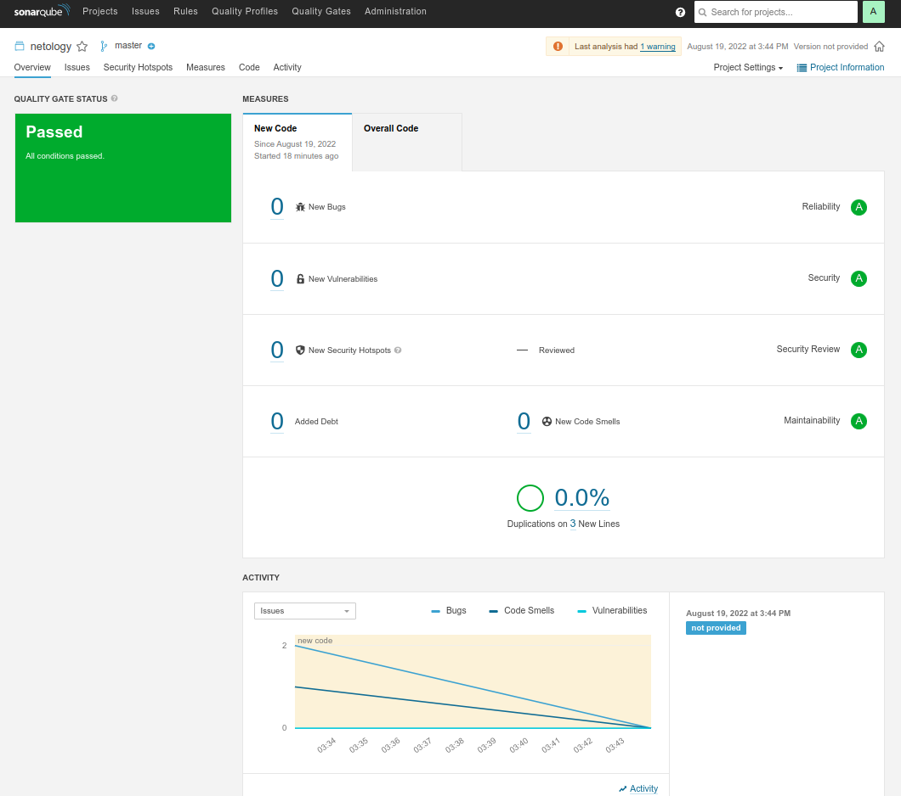

# Домашнее задание к занятию "09.02 CI\CD"

## Знакомоство с SonarQube

### Подготовка к выполнению

1. Выполняем `docker pull sonarqube:8.7-community`
2. Выполняем `docker run -d --name sonarqube -e SONAR_ES_BOOTSTRAP_CHECKS_DISABLE=true -p 9000:9000 sonarqube:8.7-community`
3. Ждём запуск, смотрим логи через `docker logs -f sonarqube`
4. Проверяем готовность сервиса через [браузер](http://localhost:9000)
5. Заходим под admin\admin, меняем пароль на свой

В целом, в [этой статье](https://docs.sonarqube.org/latest/setup/install-server/) описаны все варианты установки, включая и docker, но так как нам он нужен разово, то достаточно того набора действий, который я указал выше.

### Основная часть

1. Создаём новый проект, название произвольное
2. Скачиваем пакет sonar-scanner, который нам предлагает скачать сам sonarqube
3. Делаем так, чтобы binary был доступен через вызов в shell (или меняем переменную PATH или любой другой удобный вам способ)

```
# install_directory=~/netology/09-ci-02-cicd/sonar-scanner-4.7.0.2747-linux
# PATH=$PATH:$install_directory/bin
```

4. Проверяем `sonar-scanner --version`

```
# sonar-scanner --version
INFO: Scanner configuration file: /root/netology/09-ci-02-cicd/sonar-scanner-4.7.0.2747-linux/conf/sonar-scanner.properties
INFO: Project root configuration file: NONE
INFO: SonarScanner 4.7.0.2747
INFO: Java 11.0.14.1 Eclipse Adoptium (64-bit)
INFO: Linux 5.10.0-14-amd64 amd64
```

5. Запускаем анализатор против кода из директории [example](./example) с дополнительным ключом `-Dsonar.coverage.exclusions=fail.py`

```
sonar-scanner \
  -Dsonar.projectKey=netology \
  -Dsonar.sources=. \
  -Dsonar.host.url=http://3c.XXX.com:9000 \
  -Dsonar.login=067a80f3bee0c70b1d38f0cab6a7434b3cb825aa \
  -Dsonar.coverage.exclusions=fail.py
```

6. Смотрим результат в интерфейсе
7. Исправляем ошибки, которые он выявил(включая warnings)
8. Запускаем анализатор повторно - проверяем, что QG пройдены успешно
9. Делаем скриншот успешного прохождения анализа, прикладываем к решению ДЗ



## Знакомство с Nexus

### Подготовка к выполнению

1. Выполняем `docker pull sonatype/nexus3`
2. Выполняем `docker run -d -p 8081:8081 --name nexus sonatype/nexus3`
3. Ждём запуск, смотрим логи через `docker logs -f nexus`
4. Проверяем готовность сервиса через [бразуер](http://localhost:8081)
5. Узнаём пароль от admin через `docker exec -it nexus /bin/bash`
```
$ cat nexus-data/admin.password 
00adb7cf-ff2f-4c88-b3fc-d969bcc4dcbd
```

6. Подключаемся под админом, меняем пароль, сохраняем анонимный доступ

### Основная часть

1. В репозиторий `maven-public` загружаем артефакт с GAV параметрами:
   1. groupId: netology
   2. artifactId: java
   3. version: 8_282
   4. classifier: distrib
   5. type: tar.gz
2. В него же загружаем такой же артефакт, но с version: 8_102
3. Проверяем, что все файлы загрузились успешно
4. В ответе присылаем файл `maven-metadata.xml` для этого артефекта

[maven-metadata.xml](https://github.com/nicko203/devops-netology/blob/main/home_works/09-ci-02-cicd/maven-metadata.xml)


### Знакомство с Maven

### Подготовка к выполнению

1. Скачиваем дистрибутив с [maven](https://maven.apache.org/download.cgi)
2. Разархивируем, делаем так, чтобы binary был доступен через вызов в shell (или меняем переменную PATH или любой другой удобный вам способ)
3. Проверяем `mvn --version`
```
# mvn --version
Apache Maven 3.8.6 (84538c9988a25aec085021c365c560670ad80f63)
Maven home: /root/netology/09-ci-02-cicd/apache-maven-3.8.6
Java version: 17.0.4, vendor: Debian, runtime: /usr/lib/jvm/java-17-openjdk-amd64
Default locale: ru_RU, platform encoding: UTF-8
OS name: "linux", version: "5.10.0-14-amd64", arch: "amd64", family: "unix"
```
4. Забираем директорию [mvn](./mvn) с pom

### Основная часть

1. Меняем в `pom.xml` блок с зависимостями под наш артефакт из первого пункта задания для Nexus (java с версией 8_282)
```
<project xmlns="http://maven.apache.org/POM/4.0.0" xmlns:xsi="http://www.w3.org/2001/XMLSchema-instance"
  xsi:schemaLocation="http://maven.apache.org/POM/4.0.0 http://maven.apache.org/xsd/maven-4.0.0.xsd">
  <modelVersion>4.0.0</modelVersion>
 
  <groupId>com.netology.app</groupId>
  <artifactId>simple-app</artifactId>
  <version>1.0-SNAPSHOT</version>
   <repositories>
    <repository>
      <id>my-repo</id>
      <name>maven-public</name>
      <url>http://localhost:8081/repository/maven-public/</url>
    </repository>
  </repositories>
  <dependencies>
   <dependency>
      <groupId>netology</groupId>
      <artifactId>java</artifactId>
      <version>8_282</version>
      <classifier>distrib</classifier>
      <type>tar.gz</type>
   </dependency>
  </dependencies>
</project>
```

2. Запускаем команду `mvn package` в директории с `pom.xml`, ожидаем успешного окончания
3. Проверяем директорию `~/.m2/repository/`, находим наш артефакт
4. В ответе присылаем исправленный файл `pom.xml`  

[pom.xml](https://github.com/nicko203/devops-netology/blob/main/home_works/09-ci-02-cicd/pom.xml)

---

### Как оформить ДЗ?

Выполненное домашнее задание пришлите ссылкой на .md-файл в вашем репозитории.

---
