# Домашнее задание к занятию "09.03 Jenkins"

## Подготовка к выполнению

1. Установить jenkins по любой из [инструкций](https://www.jenkins.io/download/)
```
apt-get update
apt-get upgrade
curl -fsSL https://pkg.jenkins.io/debian-stable/jenkins.io.key | sudo tee /usr/share/keyrings/jenkins-keyring.asc > /dev/null
echo deb [signed-by=/usr/share/keyrings/jenkins-keyring.asc]     https://pkg.jenkins.io/debian-stable binary/ | sudo tee     /etc/apt/sources.list.d/jenkins.list > /dev/null
apt-get update
apt-get install fontconfig openjdk-11-jre
apt-get install jenkins
systemctl restart jenkins
systemctl status jenkins
```
2. Запустить и проверить работоспособность:  


3. Сделать первоначальную настройку
4. Настроить под свои нужды
5. Поднять отдельный cloud

`Dashboard -> Configure Cloud -> Add a new cloud (Docker)`
  
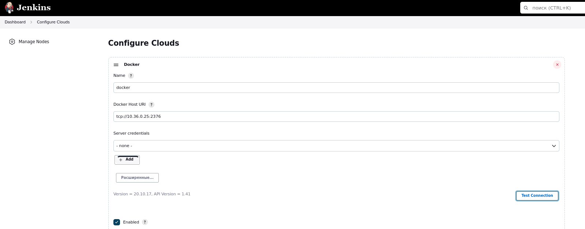


`Docker Agent templates -> Add docker template`
  


6. Для динамических агентов можно использовать [образ](https://hub.docker.com/repository/docker/aragast/agent)
7. Обязательный параметр: поставить label для динамических агентов: `ansible_docker`
8.  Сделать форк репозитория с [playbook](https://github.com/aragastmatb/example-playbook)

## Основная часть

1. Сделать Freestyle Job, который будет запускать `ansible-playbook` из форка репозитория  

Настройка:


  

  


Скриншот выполнения тестирования:  


  
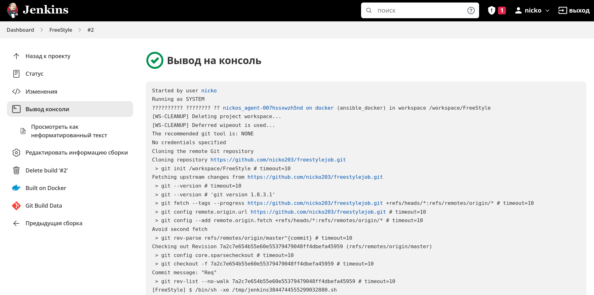
  
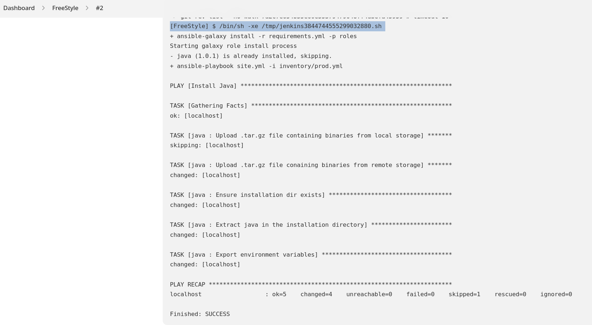


2. Сделать Declarative Pipeline, который будет выкачивать репозиторий с плейбукой и запускать её  

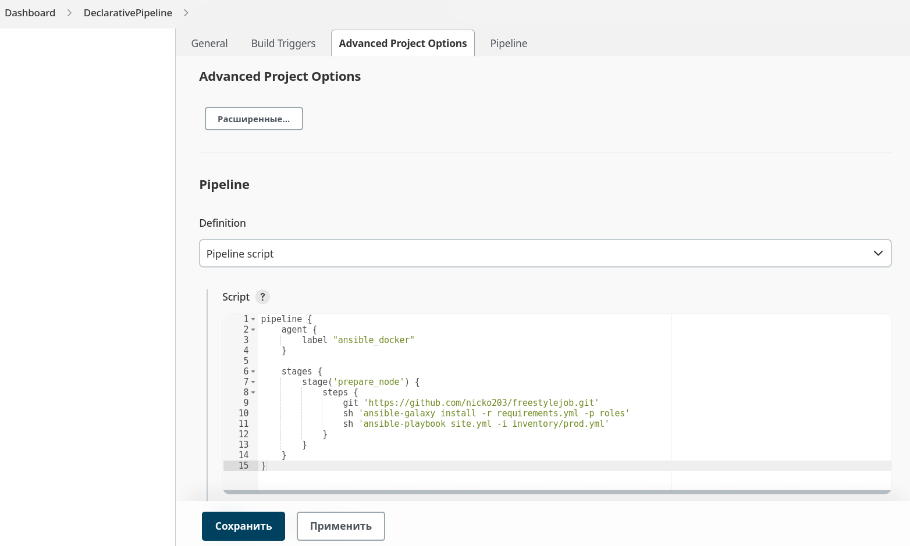

  
Скриншот выполнения тестирования:
  
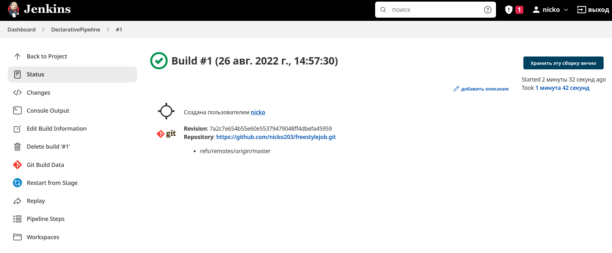
  
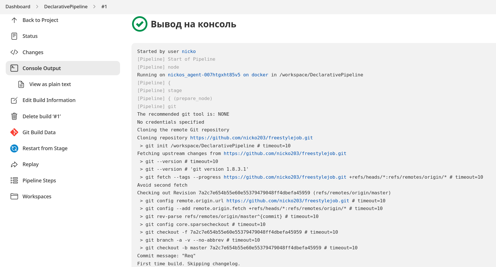
  
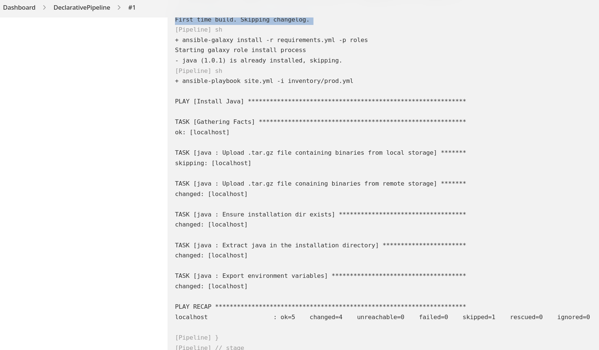

3. Перенести Declarative Pipeline в репозиторий в файл `Jenkinsfile`
  
`Jenkinsfile`  в репозитории:  
```
pipeline {
    agent {
        label "ansible_docker"
    }

    stages {
        stage('prepare_node') {
            steps {
                git 'https://github.com/nicko203/freestylejob.git'
                sh 'ansible-galaxy install -r requirements.yml -p roles'
                sh 'ansible-playbook site.yml -i inventory/prod.yml'
            }
        }
    }
}
```
4. Перенастроить Job на использование `Jenkinsfile` из репозитория  

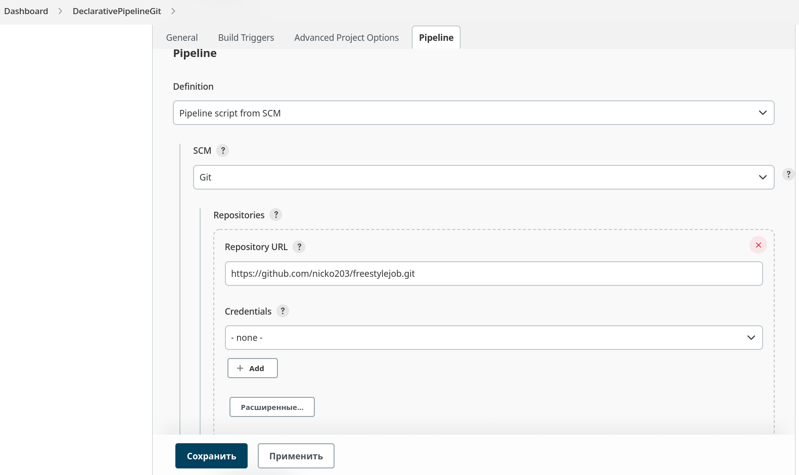
  
Скриншот выполнения тестирования:  

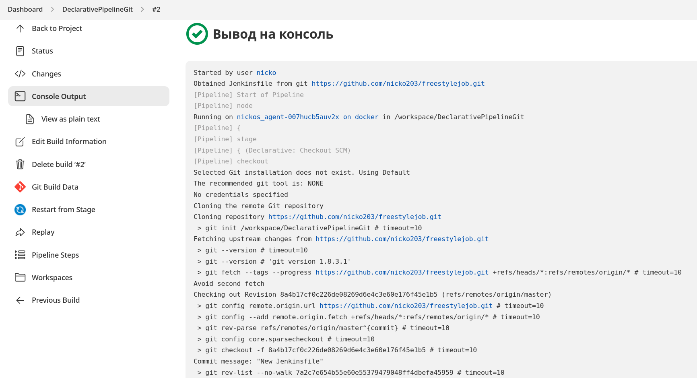
  
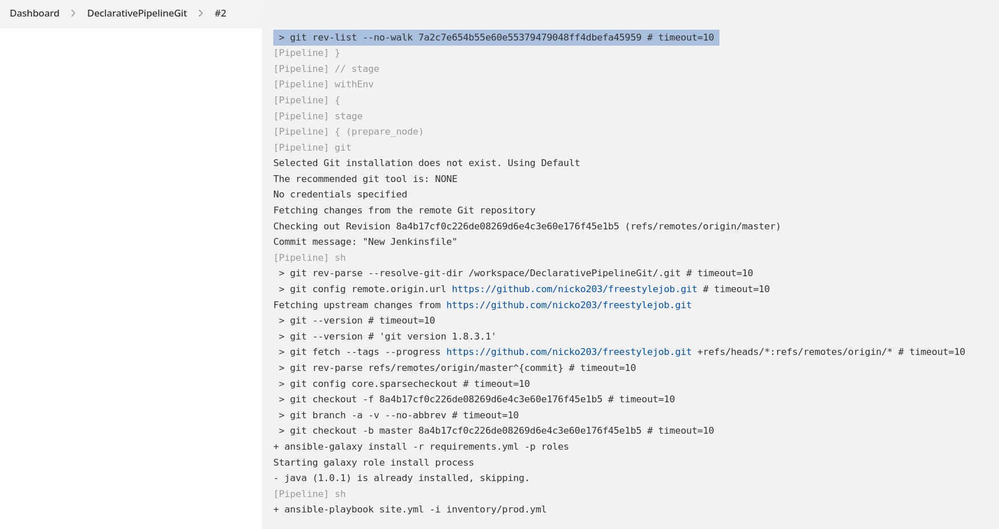
  
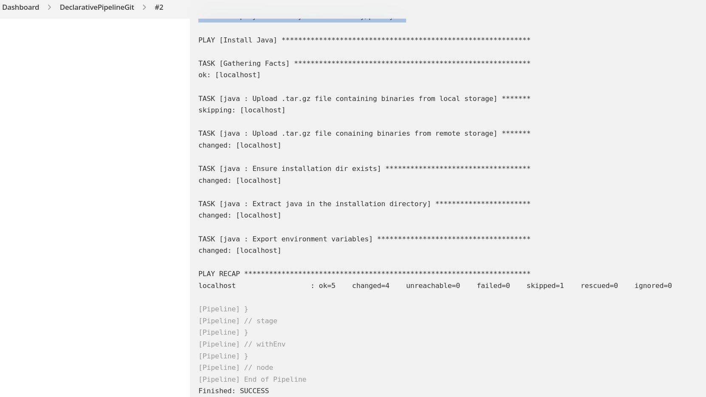

5. Создать Scripted Pipeline, наполнить его скриптом из [pipeline](./pipeline)
6. Заменить credentialsId на свой собственный
7. Проверить работоспособность, исправить ошибки, исправленный Pipeline вложить в репозитрий в файл `ScriptedJenkinsfile`
```
node("ansible_docker"){
    stage("Git checkout"){
        git credentialsId: 'adf8b006-11c5-415e-821c-5bc0d51c58bd', url: 'https://github.com/nicko203/freestylejob.git'
    }
    stage("Check ssh key"){
        secret_check=true
    }
    stage("Run playbook"){
        if (secret_check){
        sh 'ansible-galaxy install -r requirements.yml -p roles'
            sh 'ansible-playbook site.yml -i inventory/prod.yml'
        }
        else{
            echo 'no more keys'
        }
    }
}
```

Настройка аналогична пункту 4, заисключением поля Script Path - в него прописываем значение ScriptedJenkinsfile (имя файла из репозитория).

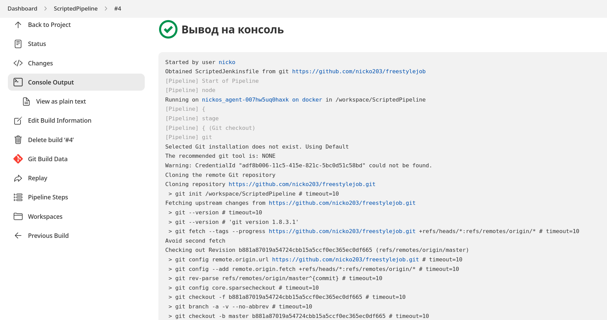
  
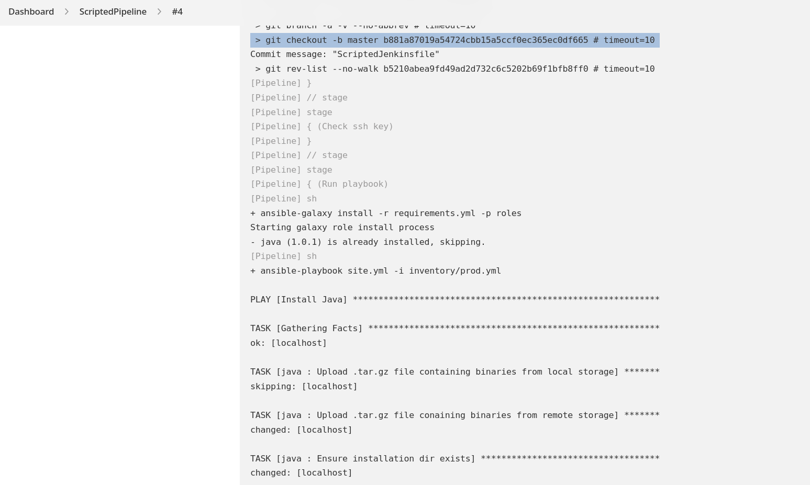
  
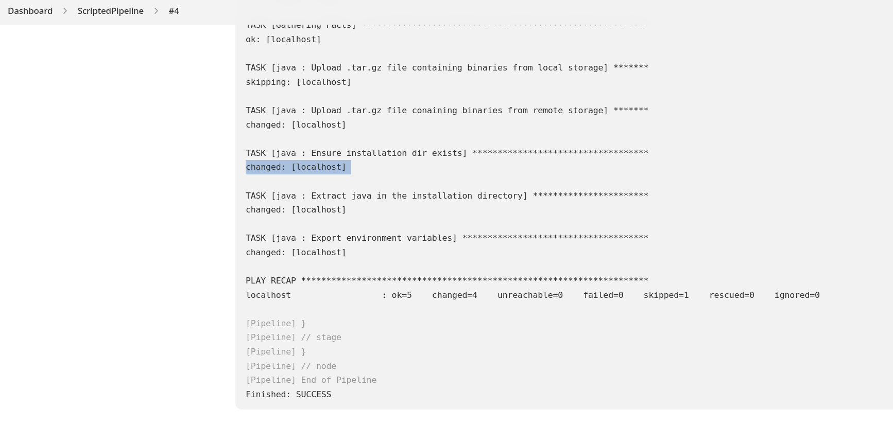


8. Отправить ссылку на репозиторий в ответе:  

https://github.com/nicko203/freestylejob.git

## Необязательная часть

1. Создать скрипт на groovy, который будет собирать все Job, которые завершились хотя бы раз неуспешно. Добавить скрипт в репозиторий с решеним с названием `AllJobFailure.groovy`
2. Установить customtools plugin
3. Поднять инстанс с локальным nexus, выложить туда в анонимный доступ  .tar.gz с `ansible`  версии 2.9.x
4. Создать джобу, которая будет использовать `ansible` из `customtool`
5. Джоба должна просто исполнять команду `ansible --version`, в ответ прислать лог исполнения джобы 

---

### Как оформить ДЗ?

Выполненное домашнее задание пришлите ссылкой на .md-файл в вашем репозитории.

---
