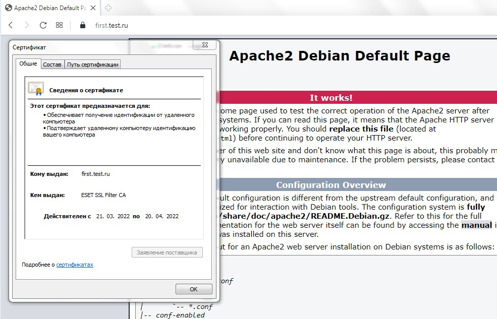

## Курсовая работа по итогам модуля "DevOps и системное администрирование"

### 1. Создайте виртуальную машину Linux.  

### 2. Установите ufw и разрешите к этой машине сессии на порты 22 и 443, при этом трафик на интерфейсе localhost (lo) должен ходить свободно на все порты.  

Последовательность команд для установки и настройки ufw:  

```apt install ufw  
ufw allow 22  
ufw allow 443  
ufw disable  
ufw enable
```  


Результат настройки:  

  


### 3. Установите hashicorp vault ( https://learn.hashicorp.com/tutorials/vault/getting-started-install?in=vault/getting-started#install-vault ).  

Доступ к репозиторию закрыт. Через VPN выкачал бинарник для своей платформы.  

*_vault -v_*
```
Vault v1.9.4 (fcbe948b2542a13ee8036ad07dd8ebf8554f56cb)
```

### 4. Cоздайте центр сертификации по инструкции ( https://learn.hashicorp.com/tutorials/vault/pki-engine?in=vault/secrets-management ) и выпустите сертификат для использования его в настройке веб-сервера nginx (срок жизни сертификата - месяц).  

Запускаю в дополнительном терминале  vault-сервер:  
```
vault server -dev -dev-root-token-id root
```

Экспортирую переменные окружения:  
```
export VAULT_ADDR=http://127.0.0.1:8200
export VAULT_TOKEN=root
```  

*__Генерирую корневой сертификат:__*  

1. Включаю механизм pki-секретов по пути  pki:

```
vault secrets enable pki
```

2. Настраиваю  механизм pki secrets engine на выдачу сертификатов с максимальным временем работы (TTL) один год ( 8640 часов):  
```
vault secrets tune -max-lease-ttl=8640h pki
```  


3. Создаю корневой сертификат и сохраняю  его в файле CA_cert.crt:  
```
vault write -field=certificate pki/root/generate/internal common_name="test.ru" ttl=8640h > CA_cert.crt
```  

4. Настраиваю URL-адреса CA и CRL:
```
vault write pki/config/urls issuing_certificates="$VAULT_ADDR/v1/pki/ca" crl_distribution_points="$VAULT_ADDR/v1/pki/crl"
```  


**_Генерирую промежуточный сертификат:_**  

1. Включаю механизм pki секретов по пути pki_int:  
```
vault secrets enable -path=pki_int pki
```  

2. Настраиваю механизм pki_int секретов на выдачу сертификатов с максимальным временем работы (TTL) один год ( 8640 часов ):  
```
vault secrets tune -max-lease-ttl=8640h pki_int
```  

3. Генерирую промежуточный сертификат  и сохраняю запрос CSR как pki_intermediate.csr:  
```
vault write -format=json pki_int/intermediate/generate/internal common_name="test.ru Intermediate Authority" | jq -r '.data.csr' > pki_intermediate.csr
```  

4. Подписываю промежуточный сертификат закрытым ключом корневого центра сертификации и сохраняю сгенерированный сертификат как intermediate.cert.pem:  
```
vault write -format=json pki/root/sign-intermediate csr=@pki_intermediate.csr format=pem_bundle ttl="86400h" | jq -r '.data.certificate' > intermediate.cert.pem
```  

5. Как только CSR будет подписан и корневой центр сертификации вернет сертификат, его можно будет импортировать обратно в Хранилище:  
```
vault write pki_int/intermediate/set-signed certificate=@intermediate.cert.pem
```  

**_Создаю роль:_**  
```
vault write pki_int/roles/test-dot-ru  allowed_domains="test.ru" allow_subdomains=true  max_ttl="8640h"
```

**_Создание сертификата:_**  (nginx уже установил)  
```
vault write -format=json  pki_int/issue/test-dot-ru common_name="first.test.ru" ttl="720h" > /etc/nginx/ssl/first.test.ru.all
```  

**_Разбор сертификата на составляющие:_**  
```
cat /etc/nginx/ssl/first.test.ru.all  | jq -r .data.private_key > /etc/nginx/ssl/first.test.ru.key
cat /etc/nginx/ssl/first.test.ru.all  | jq -r .data.certificate >  /etc/nginx/ssl/first.test.ru.cert
cat /etc/nginx/ssl/first.test.ru.all  | jq -r .data.issuing_ca >>  /etc/nginx/ssl/first.test.ru.cert
```
### 5. Установите корневой сертификат созданного центра сертификации в доверенные в хостовой системе.  

Установил корневой сертификат в Доверенные корневые центры сертификации.  

### 6. Установите nginx.  

**_apt-get install nginx_**  

### 7. По инструкции (ссылка) настройте nginx на https, используя ранее подготовленный сертификат.  

Файл конфигурации nginx **_first.test.ru_**:
```
server {
    access_log /var/log/nginx/first.test.ru.log;
    #access_log off;
    error_log /var/log/nginx/first.test.ru.error.log;

    root /var/www/html;
    index index.html index.htm index.nginx-debian.html;

    listen 443 ssl;
    server_name first.test.ru;

    location / {
        error_page 404 /404.html;
        location = /404.html 
    {
                root /var/www/html;
                internal;
        }
    }

    ssl_certificate /etc/nginx/ssl/first.test.ru.cert;
    ssl_certificate_key /etc/nginx/ssl/first.test.ru.key;

    ssl_session_cache shared:le_nginx_SSL:1m;
    ssl_session_timeout 1440m;
    ssl_protocols TLSv1 TLSv1.1 TLSv1.2;
    ssl_prefer_server_ciphers on;
    ssl_ciphers "ECDHE-ECDSA-CHACHA20-POLY1305:ECDHE-RSA-CHACHA20-POLY1305:ECDHE-ECDSA-AES128-GCM-SHA256:ECDHE-RSA-AES128-GCM-SHA256:ECDHE-ECDSA-AES256-GCM-SHA384:ECDHE-RSA-AES256-GCM-SHA384:DHE-RSA-AES128-GCM-SHA256:DHE-RSA-AES256-GCM-SHA384:ECDHE-ECDSA-AES128-SHA256:ECDHE-RSA-AES128-SHA256:ECDHE-ECDSA-AES128-SHA:ECDHE-RSA-AES256-SHA384:ECDHE-RSA-AES128-SHA:ECDHE-ECDSA-AES256-SHA384:ECDHE-ECDSA-AES256-SHA:ECDHE-RSA-AES256-SHA:DHE-RSA-AES128-SHA256:DHE-RSA-AES128-SHA:DHE-RSA-AES256-SHA256:DHE-RSA-AES256-SHA:ECDHE-ECDSA-DES-CBC3-SHA:ECDHE-RSA-DES-CBC3-SHA:EDH-RSA-DES-CBC3-SHA:AES128-GCM-SHA256:AES256-GCM-SHA384:AES128-SHA256:AES256-SHA256:AES128-SHA:AES256-SHA:DES-CBC3-SHA:!DSS";

}

```

### 8. Откройте в браузере на хосте https адрес страницы, которую обслуживает сервер nginx.  

  

### 9. Создайте скрипт, который будет генерировать новый сертификат в vault:  

```
#!/usr/bin/bash

vault write -format=json  pki_int/issue/test-dot-ru common_name="first.test.ru" ttl="720h" > /etc/nginx/ssl/first.test.ru.all
cat /etc/nginx/ssl/first.test.ru.all  | jq -r .data.private_key > /etc/nginx/ssl/first.test.ru.key
cat /etc/nginx/ssl/first.test.ru.all  | jq -r .data.certificate >  /etc/nginx/ssl/first.test.ru.cert
cat /etc/nginx/ssl/first.test.ru.all  | jq -r .data.issuing_ca >>  /etc/nginx/ssl/first.test.ru.cert
systemctl restart nginxr
```

### 10. Поместите скрипт в crontab, чтобы сертификат обновлялся какого-то числа каждого месяца в удобное для вас время.  

Скрипт будет выполняться в 03:00 первого числа каждого месяца:  
```
crontab -l
# m h  dom mon dow   command
0 3 1 * * /root/cert_create.sh
```