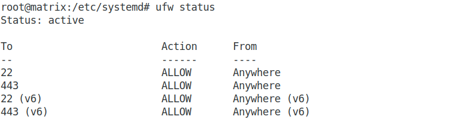

## Курсовая работа по итогам модуля "DevOps и системное администрирование"

### 1. Создайте виртуальную машину Linux.  

### 2. Установите ufw и разрешите к этой машине сессии на порты 22 и 443, при этом трафик на интерфейсе localhost (lo) должен ходить свободно на все порты.  

Последовательность команд для установки и настройки ufw:  

```apt install ufw  
ufw allow 22  
ufw allow 443  
ufw disable  
ufw enable
```  


Результат настройки:  

  


### 3. Установите hashicorp vault ( https://learn.hashicorp.com/tutorials/vault/getting-started-install?in=vault/getting-started#install-vault ).  

Доступ к репозиторию закрыт. Через VPN выкачал бинарник для своей платформы.  

*_vault -v_*
```
Vault v1.9.4 (fcbe948b2542a13ee8036ad07dd8ebf8554f56cb)
```

### 4. Cоздайте центр сертификации по инструкции ( https://learn.hashicorp.com/tutorials/vault/pki-engine?in=vault/secrets-management ) и выпустите сертификат для использования его в настройке веб-сервера nginx (срок жизни сертификата - месяц).  

Запускаю в дополнительном терминале  vault-сервер:  
```
vault server -dev -dev-root-token-id root
```

Экспортирую переменные окружения:  
```
export VAULT_ADDR=http://127.0.0.1:8200
export VAULT_TOKEN=root
```  

*_Генерирую корневой сертификат:_*  

1. Включаю механизм pki-секретов по пути  pki:

```
vault secrets enable pki
```

2. Настраиваю  механизм pki secrets engine на выдачу сертификатов с максимальным временем работы (TTL) один месяц ( 720 часов):  
```
vault secrets tune -max-lease-ttl=720h pki
```  


3. Создаю корневой сертификат и сохраняю  его в файле CA_cert.crt:  
```
vault write -field=certificate pki/root/generate/internal common_name="test.ru" ttl=720h > CA_cert.crt
```  

4. Настраиваю URL-адреса CA и CRL:
```
vault write pki/config/urls issuing_certificates="$VAULT_ADDR/v1/pki/ca" crl_distribution_points="$VAULT_ADDR/v1/pki/crl"
```  


*_Генерирую промежуточный сертификат:_*  

